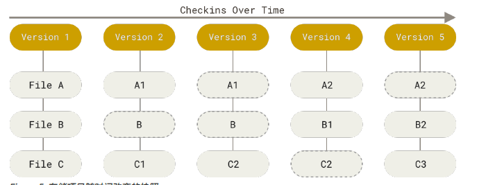
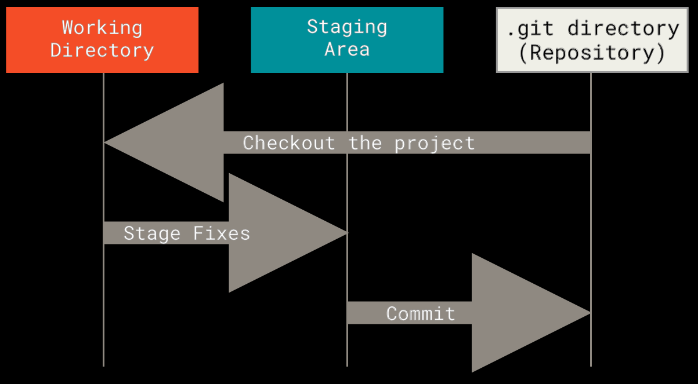

# Git 是什么
&nbsp;&nbsp;Git是版本控制系统。不同于其他的版本控制系统(CVS、Subversion、Perforce等),**git直接记录快照,而不是差异比较**(其他版本控制系统将他们存储的信息看作是一组基本文件和每个文件随时间逐渐积累的差异,这也被通常称作为**基于差异**的版本控制).
&nbsp;&nbsp;git是将数据看作是对小型文件系统的一系列快照。在git中，每当你提交更新或者保存项目状态的时候，他基本就会对当时的全部文件创建一个快照并保存这个快照的索引。为了效率，如果文件没有修改，git不会重新存储该文件，而是只保留一个指针指向之前存储的文件。git对待数据更像是一个快照流。
  + 如下图，git存储的是项目随时间改变的快照
    - 
## git特性
#### 01. 近乎所有的操作都是本地执行
+ 在Git中的绝大多数操作都只需要访问本地文件和资源,一般不需要来自网络上其他计算机的信息。在你本地磁盘上就有项目的完整历史，所以大部分操作看起来瞬间完成。 
   - 例如,要浏览项目历史,Git不需要连接到服务器去获取历史，然后再显示出来——他只需要直接从本地数据库中读取。又或者你想查看当前版本与一个月之前的版本之间引入的修改，git会查找到一个月前的文件做一次**本地的差异计算**，而不是由远程服务器处理或者从远程服务器拉回旧版本文件再来本地处理。  

#### 02. Git保证完整性
Git中所有的数据在存储前都计算校验和，然后以校验和来引用。这意味着不可能在Git不知情的情况下更改任何文件内容或目录内容.
  - 在Git中，Git数据库中保存的信息都是以文件内容的哈希值来索引，而不是文件名

#### 03. Git一般只添加数据
你执行的 Git 操作，几乎只往Git数据库中添加 数据。 你很难让 Git 执行任何不可逆操作，或者让它以任何方式清除数据。 同别的 VCS 一样，未提交更新时有可能丢失或弄乱修改的内容。但是一旦你提交快照到 Git 中， 就难以再丢失数据，特别是如果你定期的推送数据库到其它仓库的话。

#### 04. 三种状态
&nbsp;&nbsp;git有三种状态，你的文件可能处于其中之一(前提是文件已经被Git追踪了):
  1. 已提交(committed) 
      - 已提交表示数据已经完全的保存在本地数据库(文件到了Git directory(.git文件夹)中了)中
  2. 已修改(modified)
      -  已修改表示修改了文件，但是还没保存到数据库中(文件还是在工作空间中)
  3. 已暂存(staged)
      - 已暂存表示对一个已修改文件的当前版本做了标记，使之包含在下次提交的快照中(文件到了索引区)。
 &nbsp;&nbsp;如上的三种状态,**使得Git项目拥有三个阶段: 工作区(Working directory)、暂存区(又名 索引区(Index))以及Git目录(HEAD)**,如下图:
   -   
+ **工作区(三棵树中的Working directory)** 是对项目的某个版本独立提取出来的内容。 **这些从 Git 仓库的压缩数据库中提取出来的文件，放在磁盘上供你使用或修改**。
    - 最后这句加粗的话很重要,操作者是不能编辑Index和HEAD区里面的文件的,只能编辑工作区的文件的，只是将文件暂存和提交之后，文件才会分别进入暂存区和Head区。因此在分支切换的时候，只是将当前分支的HEAD区的文件解压缩到工作区提供操作这编辑。     
+  **暂存区(三棵树中的Index)** 是一个文件，保存了下次将要提交的文件列表信息，一般在 Git 仓库目录中。 按照 Git 的术语叫做“索引”，不过一般说法还是叫“暂存区”。
+ **Git目录(三棵树中的HEAD)** 是 Git 用来保存项目的元数据和对象数据库的地方。 这是 Git 中最重要的部分，从其它计算机克隆仓库时，复制的就是这里的数据。
###### 基本的Git工作流如下:
1. 在工作区中修改文件。
2. 将你想要下次提交的更改选择性地暂存，这样只会将更改的部分添加到暂存区。
3. 提交更新，找到暂存区的文件，将快照永久性存储到 Git 目录。
