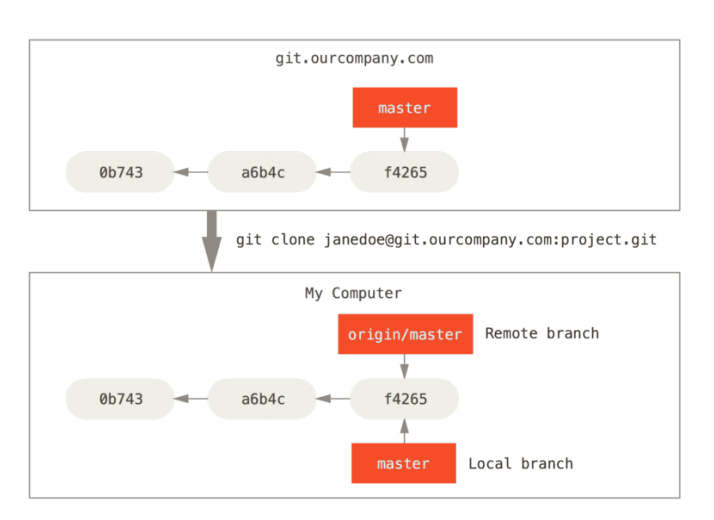
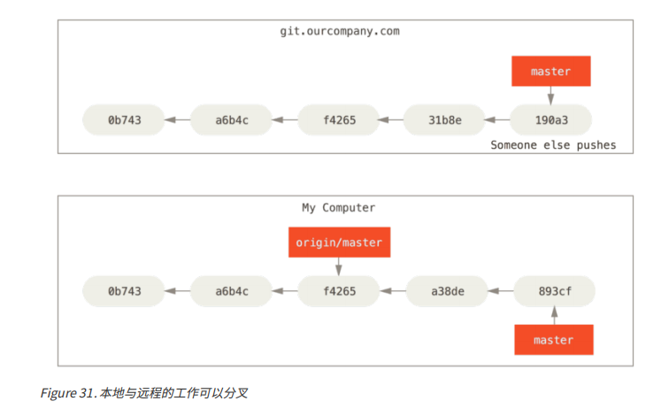
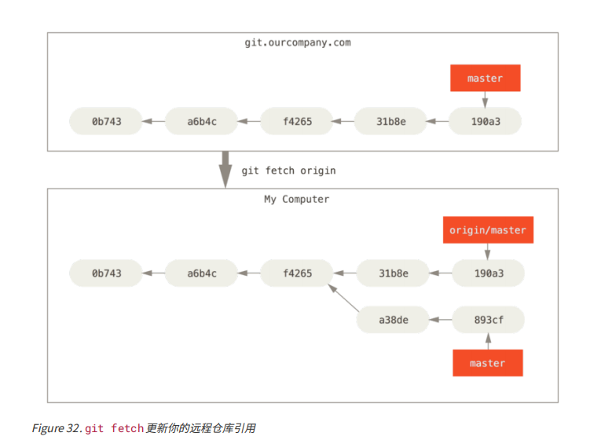

## Git 远程分支
1. 远程分支
2. 远程跟踪分支
3. 跟踪分支
4. 上游分支
### 什么是远程分支
远程分支是对远程仓库的引用(指针)，包括分支，标签等。可以通过git ls-remote（remote）来显示地获取到远程引用的完整列表。或者通过git remote show (remote)来获取远程分支的更多信息。
### 远程跟踪分支&&跟踪分支
#### 远程跟踪分支（以 (remote)/(branch) 形式命名）
远程跟踪分支是远程分支**状态**的引用。 它们是你不能移动的本地引用，当你做任何网络通信操作时，他们会自动移动。 远程跟踪分支像是你上次连接到远程仓库时那些分支所处状态的书签
  + origin/master就是一个远程跟踪分支  
  + 远程跟踪分支是本地不能移动的
     - 虽然，你可以切换到origin/master分支上进行操作，提交。但是无法推送到远程，且这些内容会丢失 
  +  假设你的网络里有一个在 git.ourcompany.com 的 Git 服务器。 如果你从这里克隆，Git 的 clone 命令会为你自动将其命名为 origin，拉取它的所有数据，创建一个指向它的 master 分支的指针，并且在本地将其命名为 origin/master。 Git 也会给你一个与 origin 的 master分支在指向同一个地方的本地 master 分支，这样你就有工作的基础。
     - git clone会在下拉的时候**自动创建**两个分支(git clone的时候，两个指针指向同一个位置)，如下图：
       + origin/master  指向远程仓库的master分支(**远程跟踪分支**)
       + master 指向本地的master分支(跟踪分支)
        

     - 本地分支可以与远程分支分叉  
       + 如果你修改了本地的master分支，同一时间，有人将修改推送到了远程分支上(即更新了远程分支)，那么你的提交历史将会朝不同的方向发展。只要你不与origin服务器相连接，你的origin/master指针就不会移动。如下图:
        

     - 如果想要同步你的工作，运行git fetch命令，这个命令将会查找origin是哪一服务器，从中抓取**本地没有的**数据，并更新本地数据库，移动origin/master指针，使他指向新的，更新后的位置(**在这个时候更新origin/master指针**)
       

       + 这里并没有同步完全，因为origin/master分支是你不可操控的分支，你需要将远程仓库仓库里面的最新内容同步到你本地分支上，成为你可以操纵的内容
         - 那么，这时候就需要是使用分支合并命令，将远程仓库的内容合并到你本地,在master分支运行(**git merge origin/master(将origin/master分支的内容合并到 当前分支)**)
### 推送
+ 当你想要公开分享一个分支时，需要将其推送到有写入权限的远程仓库上。
+ 如果希望和别人一起在名为 serverfix 的分支上工作，你可以像推送第一个分支那样推送它。 运行 git push(remote) (branch)
### 跟踪分支
### 什么是跟踪分支？
从一个远程跟踪分支检出一个本地分支会自动创建一个叫做"跟踪分支"(有时候也叫上游分支,**这个上游分支是对应的远程跟踪分支**)。跟踪分支是与远程分支有直接关系的本地分支。 如果在一个跟踪分支上输入 git pull，Git 能自动地识别去哪个服务器上抓取、合并到哪个分支
+ 当克隆一个仓库时，它通常会自动地创建一个跟踪 origin/master 的 master 分支。 
   - 即本地的master分支就是一个**跟踪分支**
   - 如何设置跟踪分支
      + git checkout -b [branch] [remotename]/[branch]。或者
      + git checkout --track origin/serverfix
   - 如何修改跟踪的上游分支
      + git branch -u origin/serverfix
### 删除远程分支
 可以运行带有 --delete 选项的 git push 命令来删
除一个远程分支。
+ git push origin --delete serverf