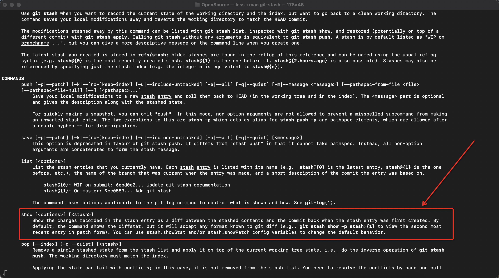
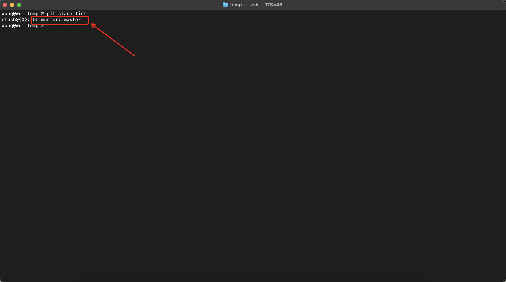

# 如何查看暂存文件与索引区文件的差异
## 命令
- git stash show #{暂存的索引}

## 命令查看
### git stash 帮助手册
- git stash --help
- 

## 疑问
### 谁和谁之间的差异(暂存和哪个commit的差异)
&nbsp;&nbsp;“暂存区” 与 “创建该暂存时所在分支的最后一次提交”

- 

    + 即，在这种情况下，git stash show 只会将index 为0的stash 与 master最后一次的commit进行比对。（如图，index为0的stash是在master分支创建的）