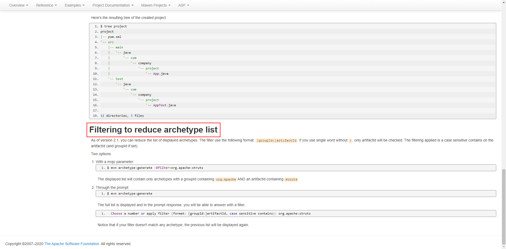

# [Maven Archetype](http://maven.apache.org/archetype/maven-archetype-plugin/)
archetype: n.原型

&nbsp;&nbsp; Archetype插件允许用户根据一个已经存在的被称之为原型的模版来创建Maven项目，并且也允许用户根据一个已经存在的项目来创建原型。如下图: 

## [Filter to reduce archetype list](http://maven.apache.org/archetype/maven-archetype-plugin/usage.html)

