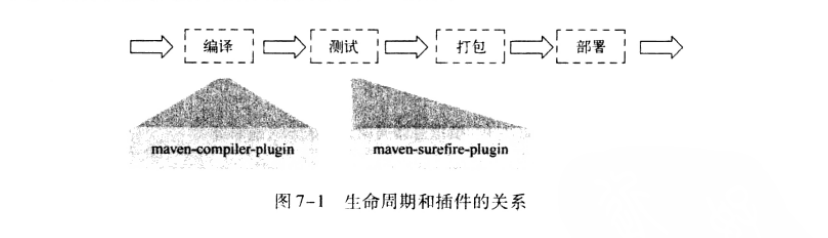
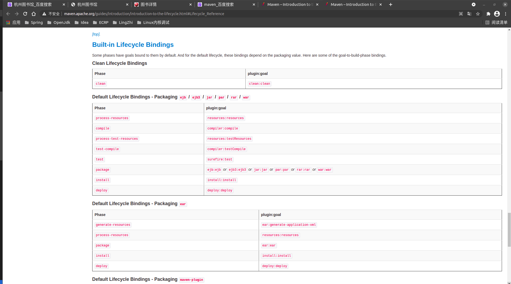
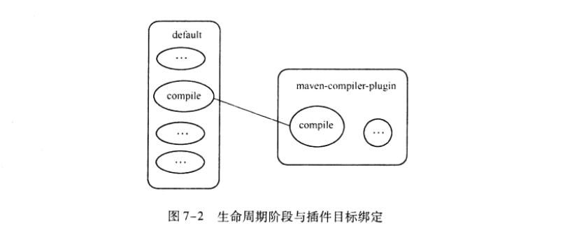
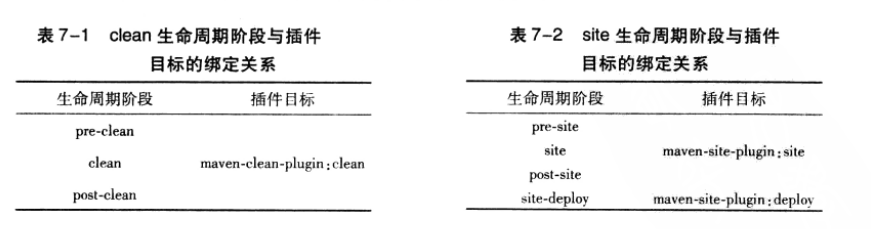
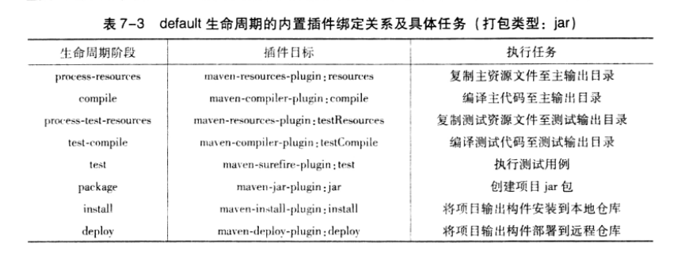
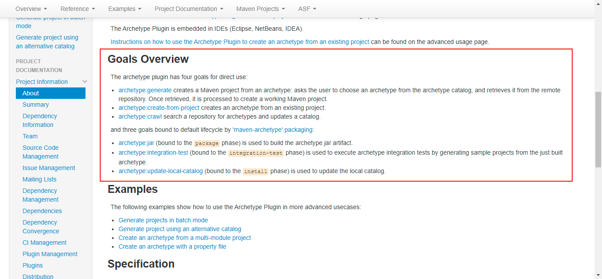

# 从Maven 命令格式来理解Maven的生命周期和插件
## 1. 什么是Maven的生命周期
1. Maven的实际构建动作都是由插件来完成的。

&nbsp;&nbsp;Maven的生命周期就是为了对所有的构建过程进行抽象和统一。Maven从大量项目和构建工具中学习和反思，然后总结了一套高度完善的，易扩展的生命周期。这个生命周期包括了项目的清理、初始化、编译、测试、打包、集成测试、验证、部署和站点生成等几乎所有的构建步骤。换句话说 几乎所有的项目的构建，都能**映射**到这样一个生命周期上。
   - 即 类似于摸板方法

&nbsp;&nbsp;Maven的生命周期是抽象的，这意味着生命周期本身不做任何实际的工作，在Maven的设计中，实际的任务(如编译源代码)都交由插件来完成。这种思想和设计模式中的模板方法类似。模板方法模式在父类中定义了算法的整体结构，自雷可以通过实现或者重写父类的方法来控制实际的行为，这样既保证了算法有足够的可拓展性，又能够严格控制算法的整体结构   
```java
    public abstract class AbstraceBuild{

        public void build(){
            initialize();
            compile();
            test();
            packagee();
            integrationTest();
            deploy();
        }

        protect abstract void initialize();
        protect abstract void compile();
        protect abstract void test();
        protect abstract void packagee();
        protect abstract void integrationTest();
        protect abstract void deploy();

    }
```
- 这段代码很简单，build()方法定义了整个构建的过程，依次初始化、编译、测试、打包、集成测试和部署，但是这个类中没有具体的实现逻辑，他们都交由子类去实现。
- 虽然上述代码和Maven的实际代码相去甚远，Maven的生命周期包含更多的步骤和更复杂的逻辑，但是没有提供具体实现，那么谁来实现这些步骤呢? 因此，**Maven设计了插件机制。每个构建步骤都可以绑定一个或多个插件行为**，而且Maven为大多数构建步骤编写并绑定了默认的插件。例如，针对于编译插件有 maven-compiler-plugin,针对于测试插件 maven-surefire-plugin等。虽然在大多数时间中，用户几乎都不会察觉到插件的存在，但实际上编译是由maven-compiler-plugin完成的，而测试是由 maven-surefire-plugin完成的。当用户有特殊需要的时候，也可以配置插件定制构建行为，甚至自己编写插件。
   - 生命周期和插件的关系: 
   - Maven定义的生命周期和插件机制一方面保证了所有Maven项目对有一致的构建标准，另一方面又通过默认插件简化和稳定了实际项目的构建。此外，该机制还提供了足够的扩展空间，用户可以通过配置现有插件或者自行编写插件来自定义构建行为

## 2. [Maven生命周期详解](http://maven.apache.org/guides/introduction/introduction-to-the-lifecycle.html#Lifecycle_Reference)
- 该页面有着Phase与goal的关系:

&nbsp;&nbsp; Maven有三套相互独立的生命周期，分别为:
1. clean: clean生命周期的目的是清理项目
2. default: default生命周期的目的是构建项目
3. site: site生命周期的目的是建立项目站点

&nbsp;&nbsp;每一个生命周期包含一些阶段(**phase,即对应mvn命令中的phase(s)**)，这些阶段都是有顺序的，并且后面的阶段依赖于前面的阶段，用户和Maven最直接的交互方式就是调用这些生命周期阶段。以clean生命周期为例子，clean生命周期包含的阶段: pre-clean 、 clean 、 post-clean。当用户：
  - 调用pre-clean的时候，只有pre-clean阶段得以执行。
  - 调用clean的时候，pre-clean,clean阶段会得以顺序执行
  - 调用post-clean时，pre-clean、clean、post-clean会得以顺序执行。

&nbsp;&nbsp;较之于生命周期阶段的前后依赖关系，三套生命周期本身是相互独立的，用户可以仅仅调用clean生命周期的某一个阶段，或者仅仅调用default生命周期的某一个阶段而不会对其他生命周期产生任何影响。

### 2-1. clean生命周期
&nbsp;&nbsp;clean生命周期的目的是清理项目，包含三个阶段:
1. pre-clean: 执行一些清理前所需要完成的工作
2. clean: 清理上一次构建生成的文件
3. post-clean: 执行一些清理后需要完成的工作。

### 2-2.default生命周期
&nbsp;&nbsp;default生命周期定义了真正构建时所需要执行的所有步骤，他是所有生命周期中最核心的部分，包含的阶段如下:部分，详细请参考:[http://maven.apache.org/guides/introduction/introduction-to-the-lifecycle.html#Lifecycle_Reference](http://maven.apache.org/guides/introduction/introduction-to-the-lifecycle.html#Lifecycle_Reference)
1. validate - validate the project is correct and all necessary information is available
2. compile - compile the source code of the project: 编译项目的主资源文件，一般来说，是src/main/java目录下的Java文件至项目输出的主classpath中。
3. test - test the compiled source code using a suitable unit testing framework. These tests should not require the code be packaged or deployed
4. package - take the compiled code and package it in its distributable format, such as a JAR.：接受编译好的代码，打包成可以发布的格式，如jar
5. verify - run any checks on results of integration tests to ensure quality criteria are met
6. install - install the package into the local repository, for use as a dependency in other projects locally: 将包安装到Maven本地仓库，供本地其他Maven项目使用。
7. deploy - done in the build environment, copies the final package to the remote repository for sharing with other developers and projects.： 将最终的包复制到远程仓库，供其他开发人员和Maven项目使用。
### 2-3. site生命周期
&nbsp;&nbsp;site生命周期的目的是建立和发布项目站点，Maven能够基于POM所包含的信息，自动生成一个友好的站点，方便团队交流和发布项目信息。该生命周期包含如下阶段: 执行一些在生成项目站点之前需要完成的工作。
1. pre-site：	execute processes needed prior to the actual project site generation:
2. site：	generate the project's site documentation： 生成项目站点文档
3. post-site：	execute processes needed to finalize the site generation, and to prepare for site deployment： 执行一些在生成项目站点之后需要完成的工作。
4. site-deploy：	deploy the generated site documentation to the specified web server：将生成的项目站点发布到服务器上。

## 3. 命令行和生命周期
### 3-1.小结
&nbsp;&nbsp;从如下的笔记来说，了解了Maven不同的生命周期的各个阶段所做的工作，可以将这些阶段(不限于一个生命周期)进行组合，来实现我们所需要的构建动作。
### 3-2. 生命周期和命令行的关系
&nbsp;&nbsp;从命令行执行Maven任务的最主要方式就是调用Maven的生命周期阶段。需要注意的是： **各个生命周期是相互独立的，而一个生命周期的阶段是有先后关系的**。将使用如下的常见的Maven命令为例，解释其执行的生命周期阶段:
1. mvn clean: 该命令调用clean生命周期的clean阶段。实际执行的阶段为clean生命周期的pre-clean 和 clean阶段。
2. mvn test: 该命令调用default生命周期的test阶段，实际执行的阶段是default生命周期的validate,initialize等，直到test的所有阶段。这就是为什么在执行测试的时候，项目的代码能够自动得以编译。
3. mvn clean install: 该命令调用了clean生命周期的clean阶段和default生命周期的install阶段。实际执行的阶段是:
      - clean生命周期的pre-clean,clean阶段，
      - 以及default生命周期的从validate至install的所有阶段。
      - 该命令结合了两个生命周期，在执行真正的项目构建之前清理项目是一个很好的实践。
4. mvn clean deploy site-deploy: 该命令调用clean生命周期的clean阶段，default生命周期的deploy阶段以及site生命周期的site-deploy阶段。实际执行的阶段为:
      - clean 生命周期的pre-clean,clean阶段，
      - default生命周期的所有阶段，
      - 以及site生命周期的所有阶段
      - 该命令结合了Maven所有三个生命周期，且deploy为default生命周期的最后一个阶段，site-deploy为site生命周期的最后一个阶段。

## 4. 插件目标
### 4-1.背景
&nbsp;&nbsp;Maven的核心仅仅定义了抽象的生命周期，具体的任务是交由插件完成的，插件以独立的构建形式存在。也正因如此，Maven核心的分发包只有不到3MB的大小，Maven会在需要的时候下载并使用插件。
### 4-2.什么是"插件目标"(即 插件的一个功能)
&nbsp;&nbsp;对于插件本身，为了能够复用代码，他往往能够完成多个任务。例如: maven-dependency-plugin,他能够基于项目依赖做很多事情，例如:
1. 能够分析项目的依赖，帮助找出潜在的无用依赖
2. 能够列出项目的依赖树，帮助分析依赖来源；
3. 能够列出项目所有已解析的依赖
4. ......

为每个这样的功能编写一个独立的插件显然是不可取的，因为这些任务背后有很多可以复用的代码，因此，这些功能聚集在一个插件里，**每个功能就是一个插件目标**。上述的功能分别对应如下的插件目标:
1. dependency:analyze
2. dependency:tree
3. dependency:list

可以看出，插件目标的通用写法为: 以冒号分隔，冒号左边是插件前缀，右边是该插件的目标。

## 5. 插件绑定
&nbsp;&nbsp;Maven的生命周期与插件相互绑定，用以完成实际的构建任务。具体来说，就是生命周期的阶段和插件的目标相互绑定，以完成某个具体的构建任务。例如:
+ 项目编译这一任务，他对应了default生命周期的compile这一阶段，而maven-compiler-plugin这一插件的compile目标能够完成该任务。因此，将他们绑定，就能实现项目编译的目的。如图:
### 5-1. 内置绑定
&nbsp;&nbsp;为了让用户几乎不用任何配置就能构建Maven项目，Maven在核心为一些主要的生命周期阶段绑定了很多插件的目标，当用户通过命令行调用生命周期阶段的时候，对应的插件目标就会执行相应的任务。

&nbsp;&nbsp;clean生命周期阶段与插件目标的绑定关系以及site生命周期阶段和插件目标的绑定关系,如下图，或者参考[官网](https://maven.apache.org/guides/introduction/introduction-to-the-lifecycle.html)
- 

&nbsp;&nbsp; 相对于clean和site生命周期，default生命周期与插件目标的绑定关系就显得复杂。这是因为对于任何项目来说，例如jar项目和war项目,他们的项目清理和站点生成任务是一样的，不过构建过程有区别。例如jar项目需要达成JAR包，而war项目需要达成WAR包。

&nbsp;&nbsp;由于项目的打包类型会影响构建的具体过程，因此，default生命周期的阶段与插件目标的绑定关系由项目打包类型所决定，打包类型是通过POM中的packaging元素来定义的。

&nbsp;&nbsp;最常见，最重要的打包类型是jar，他也是默认的打包类型。基于该打包类型的项目，default生命周期内所绑定的插件目标如下图:
- 
  + 如上图，仅列举了拥有插件绑定关系的阶段，default生命周期还有很多其他的阶段，默认他们没有绑定任何插件，因此也没有任何的实际行为。 

&nbsp;&nbsp;如在项目下执行mvn clean compile -P local -s settings.xml,对于项目输出如下:
```txt
  .....................
[INFO] 
[INFO] -----------------< com.company.eeee:eeee-project-task >-----------------
[INFO] Building eeee-project-task 1.0-SNAPSHOT                           [9/10]
[INFO] --------------------------------[ jar ]---------------------------------
[INFO] 
[INFO] --- maven-clean-plugin:3.0.0:clean (default-clean) @ eeee-project-task ---
[INFO] Deleting /home/wei/workspace/company/eeee_project_demo/eeee-project-task/target
[INFO] 
[INFO] --- maven-resources-plugin:2.5:resources (default-resources) @ eeee-project-task ---
[debug] execute contextualize
[INFO] Using 'UTF-8' encoding to copy filtered resources.
[INFO] Copying 0 resource
[INFO] Copying 3 resources
[INFO] Copying 0 resource
[INFO] 
[INFO] --- maven-compiler-plugin:3.6.1:compile (default-compile) @ eeee-project-task ---
[INFO] Changes detected - recompiling the module!
[INFO] Compiling 14 source files to /home/wei/workspace/company/eeee_project_demo/eeee-project-task/target/classes

...............
```  
- 可以看出， 执行的插件目标依次是: maven-clean-plugin:3.0.0:clean , maven-resources-plugin:2.5:resources ， maven-compiler-plugin:3.6.1:compile. 也就证实了上述的插件绑定以及生命周期的执行方式。

### 5-2. 自定义绑定
&nbsp;&nbsp;除了内置绑定，用户还能自己选择将某个插件目标绑定到生命周期的某个阶段，这种自定义绑定方式能让Maven项目在构建过程中执行更多更富特色的任务。

&nbsp;&nbsp;一个常见的例子就是创建项目的源码jar包，内置的插件绑定关系并没有涉及到这一任务，因此需要用户自行设置。maven-resource-plugin可以帮助我们完成该任务，他的jar-no-fork目标可以将该项目的主代码达成jar文件，可以将其绑定到default生命周期的verify阶段上，在执行完集成测试后和安装构建之前创建源码jar包。
```xml
<build>
   <plugins>
      <plugin>
         <groupId>org.apache.maven.plugins</groupId>
         <artifactId>maven-source-plugin</artifactId>
         <version>2.1.1</version>
         <excutions>
            <excution>
                <id>attach-sources</id>
                <phase>verify</phase>
                <goals>
                    <goal>jar-no-fork</goal>
                </goals>
            </excution>
         </excutions>
      </plugin>
   </plugins> 
</build>
```
- 在POM的build元素下的plugins子元素中生命插件的使用，该例中用到的是maven-source-plugin,其中groupId是org.apache.maven.plugins，这也是Maven官方插件的groupId，紧接着artifactId是maven-source-plugin,version是2.1.1.对于自定义绑定的插件，用户总是应该声明一个非快照版本，这样可以由于插件版本变化而造成的构建不稳定性。
- 上述配置中，除了基本的插件坐标声明之外，还有**插件执行配置**，excutions下每个excution子元素可以用来配置执行一个任务.该例中配置了一个id为attach-source的任务，通过phase配置，将其绑定到verify声明周期阶段上，再通过goals配置指定要执行的插件目标。至此，自定义插件绑定完成。
#### 5-2-1. 小结【重要】
1. 有很多插件的目标在编写时就已经定义了默认的绑定阶段。可以使用mvn-help-plugin查看插件的详细信息。
    - mvn help:describe -Dplugin=org.apache.maven.plugins:maven-source-plugin:2.1.1 -Ddetail
2. 一个生命周期阶段可以绑定多个插件目标，执行的顺序就是插件声明的顺序。     

## 6. 插件配置
&nbsp;&nbsp;用户还可以配置插件目标的参数，进一步调整插件目标所执行的任务，以满足项目需求。
### 6-1. 命令行插件配置
- 在日常的Maven使用中，我们会经常从命令行输入并执行Maven命令。在这种情况下，如果能够方便地更改某些插件的行为，无疑会十分方便。很多插件目标的参数都支持从命令行配置，用户可以在Maven命令中使用-D参数，并伴随一个参数键=参数值的形式，来配置插件目标的参数。
  + 例如，maven-surefire-plugin提供了一个maven.test.skip参数，当期值为true的时候，就会跳过测试。于是，在运行命令的时候，加上如下-D参数就能跳过测试。
     - mvn install -Dmaven.test.skip=true
### 6-2. POM中插件全局配置
&nbsp;&nbsp;并不是所有的插件都适合从命令行配置，有些参数的值从项目创建到项目发布都不会改变，或者说很少改变。对于这种情况，在POM文件中一次性配置就显然比重复在命令行输入要方便。

&nbsp;&nbsp;用户在声明插件的时候，对此插件进行一个全局的设置。也就是说，所有基于该插件目标的任务，都会使用这些配置。例如，我们通常需要配置maven-compiler-plugin，告诉他编译java1.5版本的源文件，生成与JVM1.5兼容的字节码文件，如下配置:
```xml
<build>
   <plugins>
      <plugin>
         <groupId>org.apache.maven.plugins</groupId>
         <artifactId>maven-compiler-plugin</artifactId>
         <version>2.1</version>
         <configutation>
             <source>1.5</source>
             <target>1.5</target>
         </configuration>
      </plugin>
   </plugins> 
</build>
```
- 这样，不论是绑定到compile阶段的maven-compiler-plugin:compile任务还是绑定到test-compiler阶段的maven-compiler-plugin:testCompiler任务，就都能使用该配置。

## 7. 插件信息
1. 在线插件信息，即官方文档。
2. 使用maven-help-plugin描述插件
    - 使用如下命令来描述maven-compiler-plugin2.1版本的信息
       + mvn help:describe -Dplugin=org.apache.maven.plugins:maven-compiler-plugin:2.1
## 8. 插件解析机制
&nbsp;&nbsp;如下两条命令
1. mvn help:describe -Dplugin=compiler
   - describe是maven-help-plugin的目标，这没错，但是冒号前面的help是什么？他既不是groupId，也不是artifactId。Maven是如何根据该信息找到对应版本的插件的?
2. mvn org.apache.maven.plugins:maven-help-plugin:2.1:describe -Dplugin=compiler
   - 该命令可以看出插件的groupId , artifactId,version以及goal得以清楚描述。这两条命令的效果是一样的，但1更简洁。**为了达到该目的**，Maven引入了**目标前缀**的概念，help是maven-help-plugin的目标前缀，有了插件前缀，Maven就能找到对应的artifactId。那么有了artifactId，怎么找到groupId和version呢?
### 8.1 插件解析机制(**依赖的远程仓库和插件的远程仓库在settings.xml中的配置项不是同一个**)
&nbsp;&nbsp;与依赖构件一样，插件也是基于坐标存储在Maven仓库中。在需要的时候，Maven会从本地仓库中寻找插件，如果不存在，则从远程仓库中找。找到插件之后，再下载到本地仓库使用。

&nbsp;&nbsp;但是需要注意，Maven会区别对待依赖的远程仓库与插件的远程仓库。即： 依赖有依赖自己的远程仓库(由repositories标签定义),插件有插件自己的远程仓库(由pluginRepositories标签定义)

### 8.2 插件的默认groupId
&nbsp;&nbsp; 在POM中配置插件的时候，如果该插件是Maven的官方插件，即groupId是org.apache.maven.plugins,就可以省略groupId的配置。如下：
```xml
<build>
   <plugins>
      <plugin>
         <!-- 官方插件，groupId可省略 <groupId>org.apache.maven.plugins</groupId> -->
         <artifactId>maven-compiler-plugin</artifactId>
         <version>2.1</version>
         <configutation>
             <source>1.5</source>
             <target>1.5</target>
         </configuration>
      </plugin>
   </plugins> 
</build>
```
### 8.3 解析插件版本
&nbsp;&nbsp;为了简化插件的配置和使用，在用户没有提供插件版本的情况下，Maven会自动解析插件版本:
1. 对于核心插件: Maven在超级POM中为所有核心插件设定了版本，超级POM是所有Maven项目的父POM，所有项目都继承这个超级POM的配置。因此，即使用户不加任何配置，Maven使用核心插件的时候，他们的版本就已经确定了。
    - 核心插件有哪些: maven-clean-plugin , maven-compiler-plugin , maven-surefire-plugin ...
2. 非核心插件: Maven会检查所有仓库中可以使用的版本，然后做出选择。 选择的策略是什么?

#### 8.3.1 小结
不建议依赖Maven的解析插件版本的功能，还是显式设定版本。


### 8.4 解析插件前缀
&nbsp;&nbsp;插件前缀和groupId:artifactId是一一对应的，这种匹配关系存储在仓库元数据中（仓库元数据为 groupId/maven-metadata.xml）. 当maven解析到dependency:tree这样的命令之后：
1. 他首先会基于默认的groupId归并所有插件仓库的元数据org/apache/maven/plugins/maven-metadata.xml；
2. 其次检查归并后的元数据，找到对应的artifactId为maven-dependency-plugin;
3. 然后结合当前元数据的groupId: org.apache.maven.plugins,最后使用 <8.3解析插件版本>的方式来得到version.这时候就得到了完整的插件坐标。
4. 如果ori/apache/maven/plugins/maven-metadata.xml没有记录该插件的前缀，则接着检查其他groupId下的元数据，如果都不包含，则报错。
5. 元数据本地仓库没有? 去远程仓库看一下,maven-metadata.xml部分数据如下: 
```xml
<metadata>
<plugins>
    ............................
    <plugin>
        <name>Apache Maven Checkstyle Plugin</name>
        <prefix>checkstyle</prefix>
        <artifactId>maven-checkstyle-plugin</artifactId>
    </plugin>

    <plugin>
        <name>Apache Maven Checkstyle Plugin</name>
        <prefix>checkstyle</prefix>
        <artifactId>maven-checkstyle-plugin</artifactId>
    </plugin>

    <plugin>
        <name>Apache Maven Clean Plugin</name>
        <prefix>clean</prefix>
        <artifactId>maven-clean-plugin</artifactId>
    </plugin>

    <plugin>
        <name>Apache Maven Compiler Plugin</name>
        <prefix>compiler</prefix>
        <artifactId>maven-compiler-plugin</artifactId>
    </plugin>
    ...................
</plugins>
</metadata>
```


----------------
## 9. Maven的命令格式
&nbsp;&nbsp;如下图: 

&nbsp;&nbsp;通过如上截图，可以看出，maven的命令格式:
+ mvn [options] [<goal(s)>] [<phase(s)>]
   1. options: 如mvn --help输出的，这里不做赘述
   2. goal(s): 即插件目标. 在maven插件的主页搜索Goals Overview,可以知道插件的goal.如下图: 
       - 
       - 链接:[http://maven.apache.org/archetype/maven-archetype-plugin/](http://maven.apache.org/archetype/maven-archetype-plugin/)
   3. phase(s): 即Maven的生命周期
### 9.1 什么时候使用goals，什么时候使用phases呢?
&nbsp;&nbsp;通过上述的讲解，可以了解到phase和goal的关系。那么什么时候使用goals，什么时候使用phases呢?

&nbsp;&nbsp;通过< 4-2.什么是"插件目标"(即 插件的一个功能)>可以看出，插件的目标，即goal是一个个的功能，而phase是生命周期的一个阶段(能保证当你执行一个生命周期阶段的时候，在这个阶段之前的生命周期阶段会依次执行)。因此:
+ 在非构建过程中，即仅仅需要使用插件的某个功能的时候，例如 依赖分析，列出项目依赖树等的时候，就可以使用goals
+ 在构建的过程中，则需要使用phases。因为可能构建还依赖之前的某个过程。

&nbsp;&nbsp;在构建的过程中，可以自定义构建行为，因为Maven本来就依赖插件来完成构建任务，并且一个生命周期阶段允许绑定多个goal.


