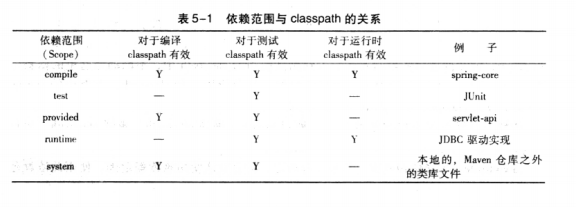
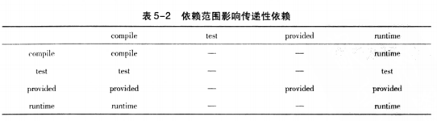
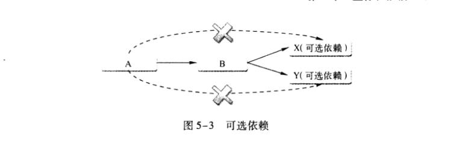
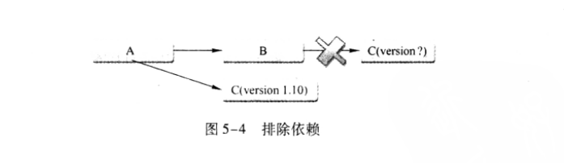
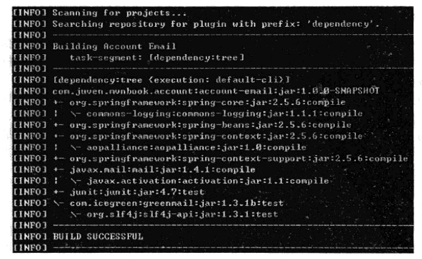

# Maven 坐标和依赖
## 坐标详解
&nbsp;&nbsp;Maven坐标为各种构件引入了秩序，任何一个构件都必须明确定义自己的坐标，而一组Maven坐标是通过一些元素定义的，他们是 groupId、artifactId、version、packaging、classifier。示例：

   ```xml
        <groupId>org.sonatype.nexus</groupId>
        <artifactId>nexus-indexer</artifactId>
        <version>2.0.0</version>
        <packaging>jar<packaging>
   ```

  - 这是nexus-indexer的坐标定义，nexus-indexer是一个对Maven仓库编撰索引并提供搜索功能的类库，他是Nexus项目的一个子模块。在上述代码片段中，其中坐标分别为： groupId:org.sonatype.nexus , artifactId: nexus-indexer , version: 2.0.0 , packaging: jar , 没有classifier。如下详细讲解该坐标:

    1. **groupId**: 定义当前Maven项目隶属的实际项目。
        + 首先，Maven项目和实际项目不一定是一对一的关系。比如SpringFramework这一实际的项目，其对应的Maven项目会有很多，例如 spring-core,spring-context等。这是由于Maven中模块的概念，因此，一个实际项目往往会被划分为很多模块。
        + 其次，groupId不应该对应项目隶属的组织或者公司。原因很简单，一个组织或者公司下会有很多实际项目。如果groupId只定义到组织级别，那么artifactId只能定义Maven项目(模块）,那么实际项目这个层将难以对应。
        + 最后，groupId的命名格式： groupId的表示方式和Java包命名的表示方式类似，通常与域名反向一一对应。上例中： groupId就是org.sonatype.nexus。org.sonatype表示Sonatype公司建立的一个非盈利性项目,nexus表示Nexus这一个实际项目。该groupId与域名nexus.sonatype.org对应。

    2. **artifactId**: 该元素定义实际项目中的一个Maven项目(模块),推荐的做法是使用实际项目名称作为artifactId的前缀，比如上例的artifactId是nexus-indexer.使用了实际项目名称作为artifactId的前缀，这样的好处是方便寻找实际构件。在默认的情况下，Maven生成的构件，其文件名称会以artifactId作为开头，如 nexus-indexer-2.0.0.jar,使用实际项目名称作为前缀之后，就能方便从一个lib文件夹中找到某个项目的一组构件。
    3. **version**: 该元素定义Maven项目当前所处的版本，如上例中nexus-indexer的版本是2.0.0，需要注意的是，Maven定义了一套完整的版本规范，以及快照(SNAPSHOT)的概念。
    4. **packaging**: 该元素定义Maven项目的打包方式。
        + 首先，打包方式通常与所生成构件的拓展名对应，比如上例中的packaging为jar，最终的文件名为nexus-indexer-2.0.0.jar;而使用war打包方式的Maven项目，最终生成的构件会有一个.war文件。但这不是绝对的。
        + 其次，打包方式会影响到构建的生命周期，例如jar打包和war打包会使用不同的命令。
        + 最后，Maven默认的packaging为jar
    5. **classifier**: 该元素用来帮助定义构建输出的一些附属构件。附属构件和主构件对应，例如上面的主构件是nexus-indexer-2.0.0.jar,该项目还可能会通过一些插件生成如nexus-indexer-2.0.0-javadoc.jar,nexus-indexer-2.0.0.source.jar这样一些附属构件，其分别包含java文档和源代码。这时候，javadoc和source就是这两个附属构件的classfier。这样，附属构件也拥有了自己唯一的坐标。

在上述5个元素中，groupId，artifactId，version是必须定义的，packaging是可选的(默认为jar),而classfier不能是直接定义的。

同时，项目构件的文件名是和坐标相对应的，一般的规则为artifactId-version\[-classifier\].packaging,\[-classifier\]表示可选。

## 依赖
### 01. 依赖的配置
  ```xml
    <project>
      ....
      <dependencies>
           <dependency>
                <groupId> ...</groupId>
                <artifactId>....</artifactId>
                <version>...</version>
                <type>...</type>
                <scope>...</scope>
                <optional>...</optional>
                <exclusions>
                   <exclusion>
                     ....
                   </exclusion>
                </exclusions>
           </dependency>
           ....
      </dependencies>
      ...
    </project>
  ```
+ 根元素project下的dependencies可以包含一个或者多个dependency元素，以声明一个或多个项目依赖。每个依赖可以包含的元素有：
   1. groupId,artifactId,version : 依赖的基本坐标，对于任何一个依赖来说，基本坐标最重要，Maven根据坐标才能找到需要的依赖。
   2. type: 依赖的类型，对于项目坐标定义的packaging。大部分情况下，该元素不必声明，默认为jar
   3. scope: 依赖的范围，见 《依赖的范围》
   4. optional: 标记是否可选。见《传递依赖》
   5. exclusions: 用来排除传递性依赖
大部分依赖声明只需要包含基本坐标，然而在一些特殊的情况下，其他元素至关重要。

### 02. 依赖范围 
### 02-1. 前提: Maven中的三种ClassPath
1. 首先需要知道，Maven在编译项目主代码的时候需要使用一套classpath。
2. 其次，Maven在编译和执行测试的时候就使用另外一套classpath。
3. 最后，实际运行Maven项目的时候，又会使用一套classpath。
### 02-2. 什么是依赖范围
&nbsp;&nbsp; 依赖范围就是用来控制依赖与这三种(编译classpath,测试classpath，运行classpath)的关系，Maven有以下集中依赖范围.
+ **compile**: 【默认】 编译依赖范围，如果没有指定，就会默认使用该依赖范围。使用该依赖范围的Maven依赖，对于编译，测试，运行三种classpath都有效。典型的就是spring-core,在编译，测试和运行的时候都需要使用该依赖。
+ **test**: 测试依赖范围。使用此依赖范围的Maven依赖，只对于测试classpath有效，在编译主代码或者运行项目的时候将无法使用该依赖。典型的例子是JUnit。
+ **provided**: 已提供依赖范围，使用此依赖范围的Maven依赖，对于编译和测试classpath有效，但是在运行时无效。典型的例子是servlet-api,编译和测试项目的时候需要此依赖，在运行项目的时候，由于容器已经提供，就不需要Maven重复引入一遍。
+ **runtime**: 运行时依赖范围，使用此依赖范围的Maven依赖，对于测试和运行classpath有效，在编译主代码时无效。典型的例子是 JDBC驱动实现：项目主代码的编译只需要JDK提供的JDBC接口，只有在执行测试或者运行项目的时候才需要实现上述接口的具体JDBC驱动。
+ **system**: 系统依赖范围，**该依赖与三种classpath的关系，与provided依赖范围完全一致**(回忆一下，编译可以，运行时报ClassNotDefind异常)。但是使用system范围的依赖时必须通过systemPath元素显示的指明依赖文件的路径。由于此类依赖不是通过Maven仓库解析的，而且往往与本机系统绑定，可能造成构建的不可移植。systemPath元素可以引用环境变量。如：
  ```xml
      <dependency>
          <groupId>javax.sql</groupId>
          <artifactId>jdbc-stdext</artifactId>
          <version>2.0</version>
          <scope>system</scope>
          <systemPath>${java.home}/lib/rt.jar</systemPath>
      </dependency>
  ```
+ import(Maven2.0.9及以上)： 导入依赖范围，该依赖范围不会对三种classpath产生实际的影响。

&nbsp;&nbsp;上述除import以外的各种依赖范围与三种classpath的关系如下图:   

### 02-3. 传递性依赖
#### 02-3-1. 什么是传递性依赖
&nbsp;&nbsp;项目依赖与构件A，构件A依赖构件B。那么在项目在引入构件A的时候，Maven会读取位于中央仓库中的该构件的POM文件，去将构件的依赖也引入到classpath中。这就是传递依赖机制的作用。

&nbsp;&nbsp; 项目ProjectDemo有一个org.springframework:spring-core:2.5.6的依赖，而实际上spring-core也有自己的依赖，我们可以直接访问位于中央仓库的该构件的POM: http://repo1.maven.org/maven2/org/springframework/spring-core/2.5.6/spring-core-2.5.6.pom。该文件包含一个commons-logging依赖，如下:
```xml
   <dependency>
       <groupId>commons-logging</groupId>
       <artifactId>commons-logging</artifactId>
       <version>1.1.1</version>
   </dependency>
```
- 该依赖没有声明依赖范围，那么其依赖范围就是compile。 
- ProjectDemo有一个compile范围的spring-core依赖，spring-core有一个compile范围的commons-logging依赖，那么commons-logging就会成为ProjectDemo的compile范围依赖，commons-logging是ProjectDemo的一个传递性依赖。如图:  
- 有了传递性依赖机制，在使用Spring Framework的时候就不用去考虑他依赖了什么，也不必担心引入多余的依赖。Maven会解析各个直接依赖的POM，将哪些必要的间接依赖，以传递性依赖的形式引入到当前项目中。

### 02-3-2. 传递性依赖和依赖范围
&nbsp;&nbsp;假设A依赖于B，B依赖于C，那么A对于B就是**第一直接依赖**，B对于C就是**第二直接依赖**,A对于C是**传递性依赖**。第一直接依赖和第二直接依赖的范围决定了传递性依赖的范围，如下图，中间的交叉单元格表示传递性依赖范围:
+ 

   - 最左一列代表第一直接依赖，最上一行代表第二直接依赖，中间交叉单元格则表示传递性依赖范围
   - 举个例子： ProjectDemo项目有一个com.icegreen:greenmail:1.3.1的直接依赖(即: 第一直接依赖)，其依赖范围是test。而greenmail又有一个javax.mail:mail:1.4的直接依赖（即:第二直接依赖），其依赖范围是compile。显然mail:1.4是ProjectDemo的传递性依赖，从表中可以看出，当第一直接依赖是test，第二直接依赖是compile时，传递性依赖的范围是test。因此: mail:1.4是ProjectDemo的一个范围是test的传递性依赖。

### 02-3-3. 依赖调解(Dependency Mediation)
&nbsp;&nbsp;Maven引入的传递性依赖机制，一方面大大简化和方便了依赖声明;另一方面，大部分情况下我们只需要关心项目的直接依赖是什么，而不用考虑这些直接依赖会引入什么传递性依赖。但有些时候，当传递性依赖造成问题的时候，我们就需要知道该传递性依赖是从哪条依赖路径引入的。
#### 依赖调解原则: 
   1. 依赖调解第一原则: 路径最近者优先
        - 例如有如下的依赖关系：项目A有这样的依赖关系： A -> B -> C -> X(1.0) , A -> D -> X(2.0)。 X是A的传递性依赖，但是两条依赖路径上有两个版本的X，那么哪个X会被Maven解析使用呢？两个版本都被解析显然明显是不对的，因为那会造成依赖重复，因此必须选择一个。那么就要进行依赖调解了。根据第一原则，该例中X(1.0)的路径长度为3,而X(2.0)的路径长度为2，因此X(2.0)会被解析使用。
   2. 依赖调解第二原则: 第一声明者优先
        - 依赖调解第一原则不能解决所有的问题，例如这样的依赖关系: A -> B -> Y(1.0) 、 A -> C -> Y(2.0),Y(1.0) 和 Y(2.0)的依赖路径长度都是一样的，那么谁会被解析使用呢？从Maven2.0.9开始，为了尽可能避免构建的不确定性，Maven定义了依赖调解第二原则： 第一声明优先。在依赖长度相等的前提下，在POM中依赖声明的顺序决定了谁会被解析使用。在此例中，B的依赖声明在C之前，那么Y(1.0)会被解析使用


### 02-3-4. 可选依赖(了解，不建议使用)
+ 即第二直接依赖的可选依赖，是不会对第一直接依赖的依赖方产生影响，需要显示声明依赖。 

&nbsp;&nbsp;假设有如下的依赖关系： 项目A依赖于项目B，项目B依赖于项目X和Y，B对于X和Y的依赖都是可选依赖： A -> B , B->X(可选)  、 B -> Y (可选)。根据传递性依赖的定义，这三个依赖的范围都是compile，那么X，Y就是A的compile的传递性依赖。然而，**由于这里的X，Y是可选依赖，依赖将不会得以传递。即： X、Y将不会对A有任何影响。**，如图: 

&nbsp;&nbsp;那为什么需要可选性依赖这一特性呢？ 可能项目B实现了两个特性，其中的特性一依赖于X，特性二依赖于Y，而这两个特性是互斥的，用于不可能同时使用两个特性。比如B是一个持久层隔离工具包，它支持多种数据库，包括MySQL、PostgreSQL等，在构建这个工具包的时候，需要这两个数据库的驱动，但是在使用这个工具包的时候，只会依赖一种数据库。

&nbsp;&nbsp; 项目B的依赖声明如下: 
  ```xml
       <project>
           <modelVersion>4.0.0</modelVersion>
           <groupId>groupId-B</groupId>
           <artifactId>artifactId-B</artifactId>
           <version>1.0</version>

           <dependencies>
              <dependency>
                  <groupId>mysql</groupId>
                  <artifactId>mysql-connector-java</artifactId>
                  <version>5.1.10</version>
                  <optional>true</optional>
              </dependency>

              <dependency>
                  <groupId>postgresql</groupId>
                  <artifactId>postgresql</artifactId>
                  <version>8.4-701.jdbc3</version>
                  <optional>true</optional>
              </dependency>
           </dependencies>
       </project>
  ```
  - 上述xml代码片段中，使用\<optional\>元素来表示mysql-connector-java 和 postgresql 这两个依赖为可选依赖，他们只对当前项目B产生影响，当其他项目依赖于B的时候，这两个依赖都不会被传递。**因此当项目A依赖于项目B的时候，如果实际使用基于MySQL数据库，那么就需要在项目A中显示的声明mysql-connector-java这一依赖**。如下代码：
    ```xml
         <project>
           <modelVersion>4.0.0</modelVersion>
           <groupId>groupId-A</groupId>
           <artifactId>artifactId-A</artifactId>
           <version>1.0</version>

           <dependencies>
              <!-- 引入项目B的坐标-->
              <dependency>
                 <groupId>groupId-B</groupId>
                 <artifactId>artifactId-B</artifactId>
                 <version>1.0</version>
              </dependency>
            
            <!-- 因为对于项目B来说，mysql-connector-java是可选依赖，在项目A使用的时候，还需要显示的引用 -->
              <dependency>
                  <groupId>mysql</groupId>
                  <artifactId>mysql-connector-java</artifactId>
                  <version>5.1.10</version>
                  <optional>true</optional>
              </dependency>

           </dependencies>
       </project>
    ```
    -关于可选性依赖还需要说明的一点就是，在理想的情况下，是不应该使用可选依赖的。从前面可以看出，使用可选依赖的一个原因是某一个项目实现了多个特性，在面向对象设计中，有一个单一职责性原则，意指一个类应该只有一项职责，而不是柔和太多的功能。这个原则在规划Maven项目的时候也同样适用。在上面的例子中，更好的做法： 为MySQL和PostgreSQL分别创建一个Maven仓库，基于同样的groupId分配不同的artifactId，如 project-b-mysql 和 project-b-postgresql,在各自的POM中声明对应的JDBC驱动依赖，而且不使用可选依赖，用户根据需要选择使用project-b-mysql 或者 project-b-postgresql。由于传递性依赖的作用，就不再声明JDBC驱动依赖

### 02-3-5. 排除依赖
&nbsp;&nbsp; 传递性依赖会给项目隐式的引用很多依赖，这极大的简化了项目依赖的管理，但是有些时候这种特性也会带来问题。例如：
+ 场景一： 当前项目有一个第三方依赖，而这个第三方依赖由于某些原因依赖了另一个类库的SNAPSHOT版本，那么这个SNAPSHOT版本就会称为当前项目的传递性依赖，而SNAPSHOT的不稳定性会直接影响到当前的项目。这时候就需要排除该SNAPSHOT，并且在当前项目中声明该类库的某个正式发布的版本。
+ 场景二: 替换某个传递性依赖。例如Sun JTA API，Hibernate依赖于这个JAR，但是由于版权的原因，该类库不在中央仓库中，而Apache Geronimo项目有一个对应的实现，这时候你就可以排除Sun JAT API ，再声明Geronimo的JTA API实现。
##### 示例
```xml
    <project>
           <modelVersion>4.0.0</modelVersion>
           <groupId>groupId-A</groupId>
           <artifactId>artifactId-A</artifactId>
           <version>1.0</version>

           <dependencies>
              
              <dependency>
                 <groupId>groupId-B</groupId>
                 <artifactId>artifactId-B</artifactId>
                 <version>1.0</version>
                 
                 <exclusions>
                    <exclusion>
                       <groupId>groupId-C</groupId>
                       <artifactId>artifactId-C</artifactId>
                    </exclusion>
                 </exclusions>

              </dependency>
             
              <dependency>
                  <groupId>groupId-C</groupId>
                  <artifactId>artifactId-C</artifactId>
                  <version>1.1.0</version>
              </dependency>

           </dependencies>
       </project>
```
-  项目A依赖于项目B，但是由于一些原因，不想引入传递依赖C，而是自己显示声明对项目C1.1.0版本的依赖。代码中exclusions元素声明排除依赖，exclusions可以包含一个或者多个exclusion子元素，因此可以排除一个或者多个传递性依赖。但是需要注意的是： 声明exclusion的时候只需要groupId和artifactId，而不需要version,这是因为只需要groupId和artifactId就能唯一定位依赖图中的某个依赖。即： Maven解析后的依赖中，不可能出现groupId和artifactId相同但是version不同的两个依赖(因为会冲突).该例的依赖逻辑图: 

### 02-3-6. 归类依赖(即对依赖进行归类)
&nbsp;&nbsp; 有一些Spring Framework的依赖，例如 org.springframework:spring-core:2.5.6 、 org.springframework:spring-beans:2.5.6、org.springframework:spring-context:2.5.6、org.springframework:spring-context-support:2.5.6,他们是来自同一个项目的不同模块。因此，所有这些依赖的版本都是相同的，而且可以预见。如果将来需要升级Spring Framework，这些依赖的版本也会一起升级。
- 使用Maven属性来统一版本。
```xml
   <project>
           <modelVersion>4.0.0</modelVersion>
           <groupId>groupId-A</groupId>
           <artifactId>artifactId-A</artifactId>
           <version>1.0</version>

           <!-- 定义Maven属性 -->
           <properties>
               <!-- 定义Spring框架版本 -->
               <springframework>2.5.6</springframework>
           </properties>

           <dependencies>
              
              <dependency>
                 <groupId>org.springframework</groupId>
                 <artifactId>spring-beans</artifactId>
                 <!-- 归类依赖 => 统一Spring框架版本-->
                 <version>${springframework}</version>
              </dependency>
             
              <dependency>
                 <groupId>org.springframework</groupId>
                 <artifactId>spring-core</artifactId>
                 <!-- 归类依赖 => 统一Spring框架版本-->
                 <version>${springframework}</version>
              </dependency>

              <dependency>
                 <groupId>org.springframework</groupId>
                 <artifactId>spring-context</artifactId>
                 <!-- 归类依赖 => 统一Spring框架版本-->
                 <version>${springframework}</version>
              </dependency>

           </dependencies>
       </project>
```
### 02-3-7. 优化依赖
+ 即通过Maven的dependency插件来进行分析，再进行优化。具体请看<[Maven插件之dependency](https://maven.apache.org/plugins/maven-dependency-plugin/)>
&nbsp;&nbsp;在软件开发的过程中，程序员会通过重构等方式来不断的优化自己的代码，使其变得更简洁、更灵活.同理，程序员也应该能够对Maven依赖了然于胸，并对其进行优化，例如去除多余的依赖，显示地声明某些必要的依赖。

&nbsp;&nbsp;Maven会主动解析所有项目的直接依赖和传递性依赖，并且根据规则正确判断每个依赖的范围，对于一些依赖冲突，也能进行调节，以确保任何一个构建只有唯一的版本在依赖中存在，在这些工作之后，最后得到的那些依赖称之为**已解析依赖**。可以运行如下的命令查看当前项目的已解析依赖:
+ mvn dependency:list

&nbsp;&nbsp;当这些依赖经过Maven解析之后，就会构成一个依赖树，通过这棵依赖树就能清楚地知道某个依赖是哪条依赖路径引入的。
+ mvn dependency:tree
+ 
  - 虽然没有声明org.sl4j:sl4j-api:1.3这一个依赖，但是他还是经过com.icegreen:greenmail:1.3成为了当前项目的传递性依赖，而且范围是test

&nbsp;&nbsp; 使用dependency：analyzer工具可以帮助分析当前项目的依赖。
