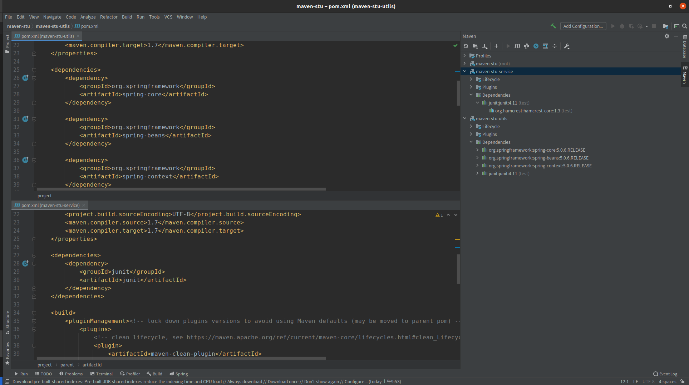

# 聚合和继承
&nbsp;&nbsp; Maven的聚合特性能够把项目的各个模块聚合在一起进行构建，而Maven的继承特性则能帮助抽取各模块相同的依赖和插件的配置，在简化POM的同时，还能促进各个模块配置的一致性。
## 01.聚合
&nbsp;&nbsp;例如有两个模块: maven-stu-utils , maven-stu-service，此时，一个简单的需求就会自然而然的显现出来： 会想要一次性构建两个项目，而不是到两个模块的目录下执行mvn命令.Maven聚合(或者称为多项目)这一个特性就是为该需求服务的。
+ maven-stu-util的pom.xml
   ```xml
   <project xmlns="http://maven.apache.org/POM/4.0.0" xmlns:xsi="http://www.w3.org/2001/XMLSchema-instance"
  xsi:schemaLocation="http://maven.apache.org/POM/4.0.0 http://maven.apache.org/xsd/maven-4.0.0.xsd">
    <modelVersion>4.0.0</modelVersion>

        <groupId>link.bosswang</groupId>
        <artifactId>maven-stu-utils</artifactId>
        <version>1.0-SNAPSHOT</version>

        <name>maven-stu-utils</name>
        <!-- FIXME change it to the project's website -->
        <url>http://www.example.com</url>

        <properties>
            <!--省略 -->
        </properties>

        <dependencies>
            <!--省略 -->
        </dependencies>

        <build>
            <pluginManagement><!-- lock down plugins versions to avoid using Maven defaults (may be moved to parent pom) -->
            <plugins>
                <!-- clean lifecycle, see https://maven.apache.org/ref/current/maven-core/lifecycles.html#clean_Lifecycle -->
                <plugin>
                    <artifactId>maven-clean-plugin</artifactId>
                    <version>3.1.0</version>
                </plugin>
                <!-- default lifecycle, jar packaging: see https://maven.apache.org/ref/current/maven-core/default-bindings.html#Plugin_bindings_for_jar_packaging -->
                <plugin>
                    <artifactId>maven-resources-plugin</artifactId>
                    <version>3.0.2</version>
                </plugin>

                <plugin>
                    <artifactId>maven-compiler-plugin</artifactId>
                    <version>3.8.0</version>
                </plugin>

                <plugin>
                    <artifactId>maven-surefire-plugin</artifactId>
                    <version>2.22.1</version>
                </plugin>

                <plugin>
                    <artifactId>maven-jar-plugin</artifactId>
                    <version>3.0.2</version>
                </plugin>

                <plugin>
                    <artifactId>maven-install-plugin</artifactId>
                    <version>2.5.2</version>
                </plugin>

                <plugin>
                    <artifactId>maven-deploy-plugin</artifactId>
                    <version>2.8.2</version>
                </plugin>

                <!-- site lifecycle, see https://maven.apache.org/ref/current/maven-core/lifecycles.html#site_Lifecycle -->
                <plugin>
                    <artifactId>maven-site-plugin</artifactId>
                    <version>3.7.1</version>
                </plugin>

                <plugin>
                    <artifactId>maven-project-info-reports-plugin</artifactId>
                    <version>3.0.0</version>
                </plugin>
            </plugins>
            </pluginManagement>
        </build>
    </project>
   ```

+ maven-stu-service的pom.xml   
   ```xml
        <project xmlns="http://maven.apache.org/POM/4.0.0" xmlns:xsi="http://www.w3.org/2001/XMLSchema-instance"
        xsi:schemaLocation="http://maven.apache.org/POM/4.0.0 http://maven.apache.org/xsd/maven-4.0.0.xsd">
            <modelVersion>4.0.0</modelVersion>

            <groupId>link.bosswang</groupId>
            <artifactId>maven-stu-service</artifactId>
            <version>1.0-SNAPSHOT</version>

            <name>maven-stu-service</name>
            <!-- FIXME change it to the project's website -->
            <url>http://www.example.com</url>

            <properties>
                <!--省略 -->
            </properties>

            <dependencies>
                <!--省略 -->
            </dependencies>

            <build>
                 <pluginManagement><!-- lock down plugins versions to avoid using Maven defaults (may be moved to parent pom) -->
            <plugins>
                <!-- clean lifecycle, see https://maven.apache.org/ref/current/maven-core/lifecycles.html#clean_Lifecycle -->
                <plugin>
                    <artifactId>maven-clean-plugin</artifactId>
                    <version>3.1.0</version>
                </plugin>
                <!-- default lifecycle, jar packaging: see https://maven.apache.org/ref/current/maven-core/default-bindings.html#Plugin_bindings_for_jar_packaging -->
                <plugin>
                    <artifactId>maven-resources-plugin</artifactId>
                    <version>3.0.2</version>
                </plugin>

                <plugin>
                    <artifactId>maven-compiler-plugin</artifactId>
                    <version>3.8.0</version>
                </plugin>

                <plugin>
                    <artifactId>maven-surefire-plugin</artifactId>
                    <version>2.22.1</version>
                </plugin>

                <plugin>
                    <artifactId>maven-jar-plugin</artifactId>
                    <version>3.0.2</version>
                </plugin>

                <plugin>
                    <artifactId>maven-install-plugin</artifactId>
                    <version>2.5.2</version>
                </plugin>

                <plugin>
                    <artifactId>maven-deploy-plugin</artifactId>
                    <version>2.8.2</version>
                </plugin>

                <!-- site lifecycle, see https://maven.apache.org/ref/current/maven-core/lifecycles.html#site_Lifecycle -->
                <plugin>
                    <artifactId>maven-site-plugin</artifactId>
                    <version>3.7.1</version>
                </plugin>
                
                <plugin>
                    <artifactId>maven-project-info-reports-plugin</artifactId>
                    <version>3.0.0</version>
                </plugin>
            </plugins>
            </pluginManagement>
            </build>
        </project>
   ```

&nbsp;&nbsp;为了能够使用一条命令就能构建maven-stu-utils , maven-stu-service两个模块，我们需要创建一个额外的名为maven-stu模块，探后根据该模块构建整个项目的所有模块。maven-stu本身就是作为一个Maven项目，他必须要有自己的POM，不过同时作为一个聚合项目，其POM又有特殊的地方。如下为maven-stu的pom.xml。
+ maven-stu下的pom.xml
    ```xml
        <project xmlns="http://maven.apache.org/POM/4.0.0" xmlns:xsi="http://www.w3.org/2001/XMLSchema-instance"
        xsi:schemaLocation="http://maven.apache.org/POM/4.0.0 http://maven.apache.org/xsd/maven-4.0.0.xsd">
        <modelVersion>4.0.0</modelVersion>

        <groupId>link.bosswang</groupId>
        <artifactId>maven-stu</artifactId>
        <packaging>pom</packaging>
        <version>1.0-SNAPSHOT</version>
        <modules>

            <module>maven-stu-utils</module>
            <module>maven-stu-service</module>
        </modules>

        <dependencies>
            <!--省略 -->
        </dependencies>

        <build>
            <pluginManagement><!-- lock down plugins versions to avoid using Maven defaults (may be moved to parent pom) -->
            <plugins>
                <!-- clean lifecycle, see https://maven.apache.org/ref/current/maven-core/lifecycles.html#clean_Lifecycle -->
                <plugin>
                    <artifactId>maven-clean-plugin</artifactId>
                    <version>3.1.0</version>
                </plugin>
                <!-- default lifecycle, jar packaging: see https://maven.apache.org/ref/current/maven-core/default-bindings.html#Plugin_bindings_for_jar_packaging -->
                <plugin>
                    <artifactId>maven-resources-plugin</artifactId>
                    <version>3.0.2</version>
                </plugin>

                <plugin>
                    <artifactId>maven-compiler-plugin</artifactId>
                    <version>3.8.0</version>
                </plugin>

                <plugin>
                    <artifactId>maven-surefire-plugin</artifactId>
                    <version>2.22.1</version>
                </plugin>

                <plugin>
                    <artifactId>maven-jar-plugin</artifactId>
                    <version>3.0.2</version>
                </plugin>

                <plugin>
                    <artifactId>maven-install-plugin</artifactId>
                    <version>2.5.2</version>
                </plugin>

                <plugin>
                    <artifactId>maven-deploy-plugin</artifactId>
                    <version>2.8.2</version>
                </plugin>

                <!-- site lifecycle, see https://maven.apache.org/ref/current/maven-core/lifecycles.html#site_Lifecycle -->
                <plugin>
                    <artifactId>maven-site-plugin</artifactId>
                    <version>3.7.1</version>
                </plugin>
                
                <plugin>
                    <artifactId>maven-project-info-reports-plugin</artifactId>
                    <version>3.0.0</version>
                </plugin>
            </plugins>
            </pluginManagement>
        </build>

        </project>
    ```
    - 这里有一个特殊的地方为packing,其值为pom，**对于聚合模块来说，其打包方式packaging的值必须为pom，否则无法构建**。
    - POM的name字段是为了给项目提供一个更容易阅读的名字。之后就是实现聚合的最核心的配置: modules。用户可以通过在一个打包方式为pom的Maven项目中声明任意数量的module元素来实现模块的聚合。这里每个module的值都是一个当前POM的相对目录。例如，这里maven-stu就对应了目录: /home/wei/workspace/LocalWorkSpace/maven-stu/pom.xml,那么maven-stu-utils就对应/home/wei/workspace/LocalWorkSpace/maven-stu/maven-stu-utils.
    - 为了方便用户构建项目，通常将聚合模块放在项目目录的最顶层，其他模块则作为聚合模块的子目录存在，这样当用户得到源码的时候，第一眼发现的就是聚合模块的POM，不用从多个模块中去寻找聚合模块来构建整个项目。如下图，maven-stu 与其他两个模块的目录结构关系: 
       + 
       - 关于目录结构，需要注意的是，聚合模块与其他项目的目录结构并非一定要是父子关系。如果使用平行目录结构，聚合模块的POM也需要做相应的修改，以指向正确的模块目录:
           ```xml
              <modules>
                 <module>../maven-stu-utils</module>
                 <module>../maven-stu-service</module>
              </modules>
           ```

&nbsp;&nbsp;最后，为了直观感受，看一下从聚合模块执行mvn clean compile 命令会得到如何的输出:(内容不多，全部贴出)
```txt
wei@Wang:~/workspace/LocalWorkSpace/maven-stu$ mvn clean compile
[INFO] Scanning for projects...
[INFO] ------------------------------------------------------------------------
[INFO] Reactor Build Order:
[INFO] 
[INFO] maven-stu-utils                                                    [jar]
[INFO] maven-stu-service                                                  [jar]
[INFO] maven-stu                                                          [pom]
[INFO] 
[INFO] -------------------< link.bosswang:maven-stu-utils >--------------------
[INFO] Building maven-stu-utils 1.0-SNAPSHOT                              [1/3]
[INFO] --------------------------------[ jar ]---------------------------------
[INFO] 
[INFO] --- maven-clean-plugin:3.1.0:clean (default-clean) @ maven-stu-utils ---
[INFO] Deleting /home/wei/workspace/LocalWorkSpace/maven-stu/maven-stu-utils/target
[INFO] 
[INFO] --- maven-resources-plugin:3.0.2:resources (default-resources) @ maven-stu-utils ---
[INFO] Using 'UTF-8' encoding to copy filtered resources.
[INFO] skip non existing resourceDirectory /home/wei/workspace/LocalWorkSpace/maven-stu/maven-stu-utils/src/main/resources
[INFO] 
[INFO] --- maven-compiler-plugin:3.8.0:compile (default-compile) @ maven-stu-utils ---
[INFO] Changes detected - recompiling the module!
[INFO] Compiling 1 source file to /home/wei/workspace/LocalWorkSpace/maven-stu/maven-stu-utils/target/classes
[INFO] 
[INFO] ------------------< link.bosswang:maven-stu-service >-------------------
[INFO] Building maven-stu-service 1.0-SNAPSHOT                            [2/3]
[INFO] --------------------------------[ jar ]---------------------------------
[INFO] 
[INFO] --- maven-clean-plugin:3.1.0:clean (default-clean) @ maven-stu-service ---
[INFO] Deleting /home/wei/workspace/LocalWorkSpace/maven-stu/maven-stu-service/target
[INFO] 
[INFO] --- maven-resources-plugin:3.0.2:resources (default-resources) @ maven-stu-service ---
[INFO] Using 'UTF-8' encoding to copy filtered resources.
[INFO] skip non existing resourceDirectory /home/wei/workspace/LocalWorkSpace/maven-stu/maven-stu-service/src/main/resources
[INFO] 
[INFO] --- maven-compiler-plugin:3.8.0:compile (default-compile) @ maven-stu-service ---
[INFO] Changes detected - recompiling the module!
[INFO] Compiling 1 source file to /home/wei/workspace/LocalWorkSpace/maven-stu/maven-stu-service/target/classes
[INFO] 
[INFO] ----------------------< link.bosswang:maven-stu >-----------------------
[INFO] Building maven-stu 1.0-SNAPSHOT                                    [3/3]
[INFO] --------------------------------[ pom ]---------------------------------
[INFO] 
[INFO] --- maven-clean-plugin:3.1.0:clean (default-clean) @ maven-stu ---
[INFO] ------------------------------------------------------------------------
[INFO] Reactor Summary for maven-stu 1.0-SNAPSHOT:
[INFO] 
[INFO] maven-stu-utils .................................... SUCCESS [  0.934 s]
[INFO] maven-stu-service .................................. SUCCESS [  0.053 s]
[INFO] maven-stu .......................................... SUCCESS [  0.013 s]
[INFO] ------------------------------------------------------------------------
[INFO] BUILD SUCCESS
[INFO] ------------------------------------------------------------------------
[INFO] Total time:  1.130 s
[INFO] Finished at: 2021-03-28T10:24:00+08:00
[INFO] ------------------------------------------------------------------------
```
- Maven 首先会解析聚合模块的POM，分析要构建的模块，并计算出一个反应堆构建顺序(Reactor Build Order),然后根据这个顺序依次构建各个模块。反应堆是所有模块组成的一个构建结构。
- 上述输出显示的是各个模块的名称，因此，在配置的时候不要省略name属性

--------

## 02.继承
&nbsp;&nbsp;从上述的pom.xml文件来看，maven-stu-utils 和 maven-stu-service这两个模块有着许多相同的配置，例如有相同的groupId,version,有相同的依赖(配置文件省略了)，还有相同的maven-compiler-plugin等插件配置。那么，这就是重复的配置了，重复，就意味着更多的劳动和更多潜在的问题。在Maven中，可以使用POM的继承来抽取出重复的配置。

&nbsp;&nbsp;继续以maven-stu , maven-stu-utils,maven-stu-service举例，令maven-stu为父模块，让另外的模块来继承他，修改maven-stu-utils的pom.xml如下:
```xml
<project xmlns="http://maven.apache.org/POM/4.0.0" xmlns:xsi="http://www.w3.org/2001/XMLSchema-instance"
         xsi:schemaLocation="http://maven.apache.org/POM/4.0.0 http://maven.apache.org/xsd/maven-4.0.0.xsd">
    <modelVersion>4.0.0</modelVersion>

    <parent>
        <groupId>link.bosswang</groupId>
        <artifactId>maven-stu</artifactId>
        <version>1.0-SNAPSHOT</version>
        <!-- relativePath非必须，默认值为../pom.xml-->
        <relativePath>../pom.xml</relativePath>
    </parent>

    <artifactId>maven-stu-utils</artifactId>

    <name>maven-stu-utils</name>

    <!-- 省略其他配置 -->
</project>    
```
- 上述的POM中使用了parent元素声明父模块，parent下的子元素groupId，artifactId和version制定了父模块的坐标，这三个元素是必须的。
- 这个更新过的POM没有为maven-stu-utils声明groupId和version,不过这并不代表maven-stu-utils没有groupId和version。实际上，这个子模块隐式地从父模块继承了这两个元素，这也就消除了一些不必要的配置。在该例子中，父子模块使用相同的groupId和version,如果遇到子模块需要使用和父模块不一样的groupId或者version的情况,那么用户完全可以在子模块中显式声明。对于artifactId元素来说，子模块应该显示声明，一反面，如果完全继承groupId,artifactId，version,会造成坐标冲突；另一方面，即时使用不同的groupId或者version，同样的artifactId也容易造成混淆。

### 02-1.  可继承的POM元素 
&nbsp;&nbsp;可继承的POM元素如下: 点击进入pom文件介绍:[https://maven.apache.org/pom.html](https://maven.apache.org/pom.html)
+ groupId: 项目组ID
+ version： 项目版本
+ description： 项目的描述信息
+ url： 项目的URL地址
+ inceptionYear： 项目的创始年份
+ organization： 项目的组织信息
+ licenses： 见官网
+ developers： 项目的开发者信息
+ contributors： 项目的贡献者信息
+ mailingLists： 项目的邮件列表信息
+ scm： 项目的版本控制系统信息
+ issueManagement： 项目的缺陷跟踪系统信息
+ ciManagement： 项目的持续集成系统信息
+ properties： 自定义的Maven属性
+ dependencyManagement：项目的依赖管理配置
+ dependencies： 项目的依赖配置
+ repositories： 项目的仓库配置
+ pluginRepositories：  项目的插件仓库管理
+ build： 包括项目的源码目录配置、输出目录配置、插件配置、插件管理配置等
+ reporting： 包括项目的报告输出目录配置，报告插件配置的
+ profiles: 见官网


### 02-2.dependencyManagement元素介绍
&nbsp;&nbsp;例如，现在有一个项目PA,父模块为A，子模块分别为B，C。B,C同时依赖org.springframework:spring-core:5.0.6,org.springframework:spring-beans:5.0.6,org.springframework:spring-context:5.0.6,junit:junit:4.12,因此可以将这些依赖放置到父模块A中，B,C就能移除这些依赖，简化配置。

&nbsp;&nbsp;上述的做法是可行的，但是存在问题。即： 现在我们确定B,C都包含这几个依赖，但是无法确定将来添加的子模块就一定需要这几个依赖。假如未来项目需要需要添加一个D模块，该模块只是提供一些简单的帮助工具，与spring完全无关，此时就不需要依赖spring的依赖了。

&nbsp;&nbsp;Maven 提供的dependencyManagement元素既能让子模块继承到父模块的依赖配置，也能保证子模块依赖使用的灵活性。在dependencyManagement元素下的依赖声明不会引入实际的依赖（但是还是会被子模块继承），不过他可以约束dependencies下的依赖使用。例如，A的pom.xml
```xml

    <project xmlns="http://maven.apache.org/POM/4.0.0" xmlns:xsi="http://www.w3.org/2001/XMLSchema-instance"
            xsi:schemaLocation="http://maven.apache.org/POM/4.0.0 http://maven.apache.org/xsd/maven-4.0.0.xsd">
        <modelVersion>4.0.0</modelVersion>

        <groupId>link.bosswang</groupId>
        <artifactId>A</artifactId>
        <packaging>pom</packaging>
        <version>1.0-SNAPSHOT</version>

        <name>maven-stu</name>
        <!-- FIXME change it to the project's website -->
        <url>http://www.example.com</url>

        <properties>
            <project.build.sourceEncoding>UTF-8</project.build.sourceEncoding>
            <maven.compiler.source>1.7</maven.compiler.source>
            <maven.compiler.target>1.7</maven.compiler.target>
            <springframework.version>5.0.6.RELEASE</springframework.version>
        </properties>
        

        <dependencyManagement>
            <dependencies>
                <dependency>
                    <groupId>org.springframework</groupId>
                    <artifactId>spring-core</artifactId>
                    <version>${springframework.version}</version>
                </dependency>

                <dependency>
                    <groupId>org.springframework</groupId>
                    <artifactId>spring-beans</artifactId>
                    <version>${springframework.version}</version>
                </dependency>

                <dependency>
                    <groupId>org.springframework</groupId>
                    <artifactId>spring-context</artifactId>
                    <version>${springframework.version}</version>
                </dependency>

                <dependency>
                    <groupId>junit</groupId>
                    <artifactId>junit</artifactId>
                    <version>4.11</version>
                    <scope>test</scope>
                </dependency>

            </dependencies>
        </dependencyManagement>

        <build>
            <pluginManagement><!-- lock down plugins versions to avoid using Maven defaults (may be moved to parent pom) -->
                <plugins>
                    <!-- clean lifecycle, see https://maven.apache.org/ref/current/maven-core/lifecycles.html#clean_Lifecycle -->
                    <plugin>
                        <artifactId>maven-clean-plugin</artifactId>
                        <version>3.1.0</version>
                    </plugin>
                    <!-- default lifecycle, jar packaging: see https://maven.apache.org/ref/current/maven-core/default-bindings.html#Plugin_bindings_for_jar_packaging -->
                    <plugin>
                        <artifactId>maven-resources-plugin</artifactId>
                        <version>3.0.2</version>
                    </plugin>
                    <plugin>
                        <artifactId>maven-compiler-plugin</artifactId>
                        <version>3.8.0</version>
                    </plugin>
                    <plugin>
                        <artifactId>maven-surefire-plugin</artifactId>
                        <version>2.22.1</version>
                    </plugin>
                    <plugin>
                        <artifactId>maven-jar-plugin</artifactId>
                        <version>3.0.2</version>
                    </plugin>
                    <plugin>
                        <artifactId>maven-install-plugin</artifactId>
                        <version>2.5.2</version>
                    </plugin>
                    <plugin>
                        <artifactId>maven-deploy-plugin</artifactId>
                        <version>2.8.2</version>
                    </plugin>
                    <!-- site lifecycle, see https://maven.apache.org/ref/current/maven-core/lifecycles.html#site_Lifecycle -->
                    <plugin>
                        <artifactId>maven-site-plugin</artifactId>
                        <version>3.7.1</version>
                    </plugin>
                    <plugin>
                        <artifactId>maven-project-info-reports-plugin</artifactId>
                        <version>3.0.0</version>
                    </plugin>
                </plugins>
            </pluginManagement>
        </build>
    </project>

```
- 该父模块使用了归类依赖的方式，将spring框架的版本以变量的形式提取出来，不仅消除了一些重复，也使得各个依赖的版本处于更加明显的位置。
- 这里使用dependencyManagement声明的依赖既不会给A引入依赖，也不会给他的子模块引入依赖，**不过这段配置是会被继承的**。现在修改B的pom.xml如下:
```xml
    <?xml version="1.0" encoding="UTF-8"?>

    <project xmlns="http://maven.apache.org/POM/4.0.0" xmlns:xsi="http://www.w3.org/2001/XMLSchema-instance"
            xsi:schemaLocation="http://maven.apache.org/POM/4.0.0 http://maven.apache.org/xsd/maven-4.0.0.xsd">
        <modelVersion>4.0.0</modelVersion>

        <parent>
            <groupId>link.bosswang</groupId>
            <artifactId>A</artifactId>
            <version>1.0-SNAPSHOT</version>
        </parent>

        <artifactId>B</artifactId>

        <name>B</name>
        <!-- FIXME change it to the project's website -->
        <url>http://www.example.com</url>

        <properties>
            <project.build.sourceEncoding>UTF-8</project.build.sourceEncoding>
            <maven.compiler.source>1.7</maven.compiler.source>
            <maven.compiler.target>1.7</maven.compiler.target>
        </properties>

        <dependencies>
            <dependency>
                <groupId>org.springframework</groupId>
                <artifactId>spring-core</artifactId>
            </dependency>

            <dependency>
                <groupId>org.springframework</groupId>
                <artifactId>spring-beans</artifactId>
            </dependency>

            <dependency>
                <groupId>org.springframework</groupId>
                <artifactId>spring-context</artifactId>
            </dependency>

            <dependency>
                <groupId>junit</groupId>
                <artifactId>junit</artifactId>
            </dependency>
        </dependencies>

        <build>
            <!-- 省略 -->
        </build>
    </project>

```
- 所有的springframework依赖只配置了groupId和artifactId，省去了version，而junit依赖不仅省去了version，还省去了依赖范围scope.这些信息可以省略是因为B继承了A的dependencyManagement配置，完整的依赖声明已经包含在父POM中，子模块只需要配置简单的groupId和artifactId就能获得对应的依赖信息，从而引入正确的依赖。
- 如下图:
   + A: 类似于maven-stu , B 类似于 maven-stu-utils.如图显示，在dependencyManagement声明了依赖，但是该依赖并不会影响到子模块，在子模块中需要手动显式引入(看右边 Dependencies)
   + 