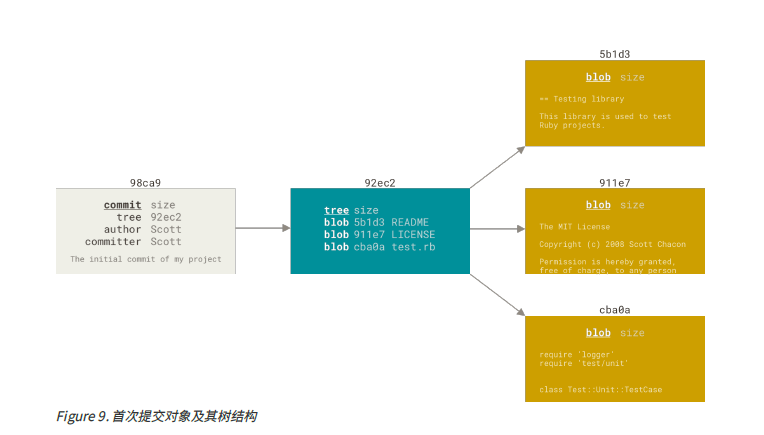

# Git是如何保存数据的
&nbsp;&nbsp;Git保存的不是文件变化或者差异，而是一系列不同时刻的快照
&nbsp;&nbsp;在进行提交操作的时候，Git会保存一个提交对象(commit object).该提交对象会包含一个执行暂存内容快照的指针，但不仅仅是这样，该提交对象还包含作者的姓名和邮箱、提交时输入的信息以及指向他父对象的指针。首次提交的产生的提交对象没有父对象，普通提交操作产生的提交对象有一个父对象，而由多个分支合并产生的对象有多个父对象。
&nbsp;&nbsp;为了更加形象地说明，我们假设现在有一个工作目录，里面包含了三个将要被暂存和提交的文件。 暂存操作会为每一个文件计算校验和（使用我们在 起步 中提到的 SHA-1 哈希算法），然后会把当前版本的文件快照保存到Git 仓库中 （**Git 使用 blob 对象来保存它们**），最终将校验和加入到暂存区域等待提交：
   1. git add README test.rb LICENSE
   2. git commit -m 'The initial commit of my project'
+ 当使用 git commit 进行提交操作时，Git 会先计算每一个子目录（本例中只有项目根目录）的校验和， 然后在 Git 仓库中这些校验和保存为树对象。随后，Git 便会创建一个提交对象， 它除了包含上面提到的那些信息外，还包含指向这个树对象（项目根目录）的指针。 如此一来，Git 就可以在需要的时候重现此次保存的快照。现在，Git 仓库中有五个对象：三个 blob 对象（保存着文件快照）、一个 树 对象（记录着目录结构和 blob 对象索引）以及一个 提交 对象（包含着指向前述树对象的指针和所有提交信息）。如下图:
  - 
+ 做些修改后再次提交，那么这次产生的提交对象会包含一个指向上次提交对象（父对象）的指针。
  - 
  - **Git 的分支，其实本质上仅仅是指向提交对象的可变指针。 Git 的默认分支名字是 master。 在多次提交操作之后，你其实已经有一个指向最后那个提交对象的 master 分支。 master 分支会在每次提交时自动向前移动。**
+ 分支以及提交历史
   - 