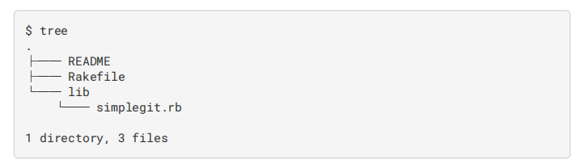
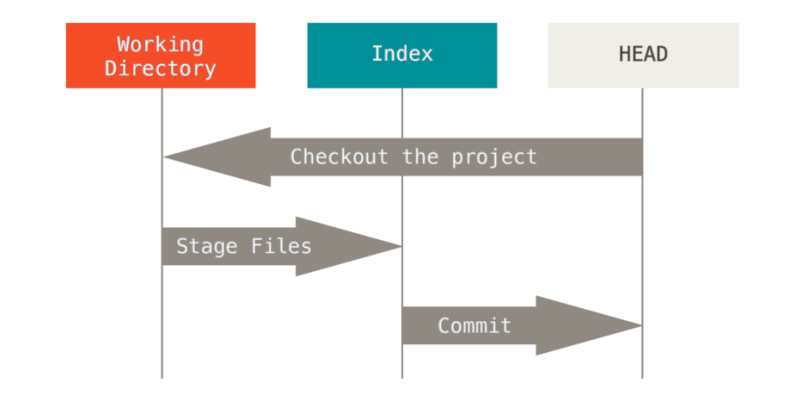
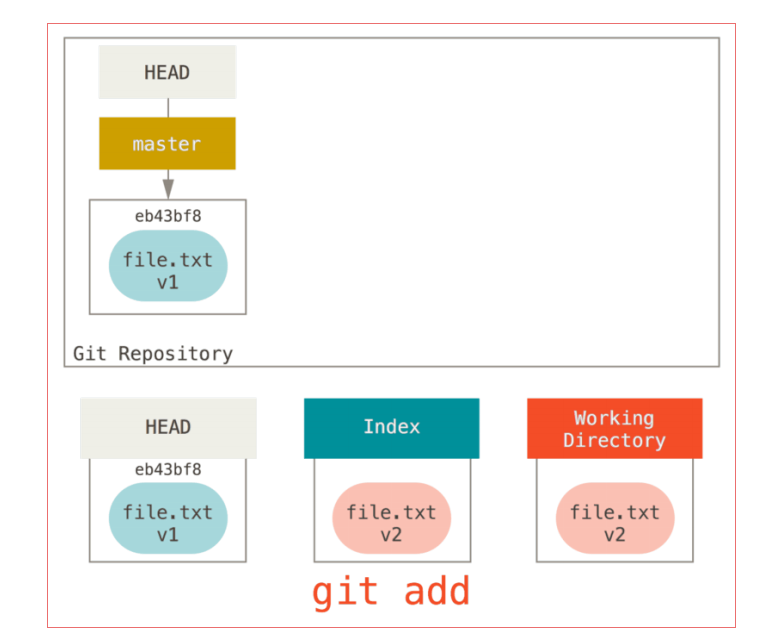
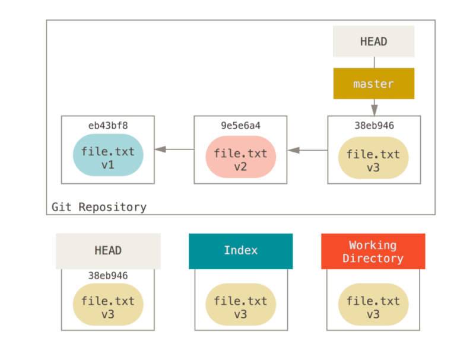
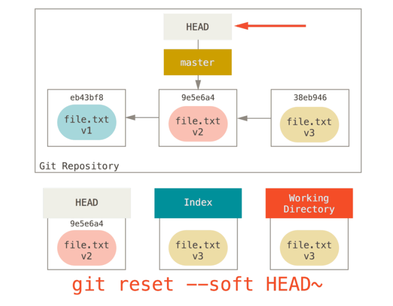
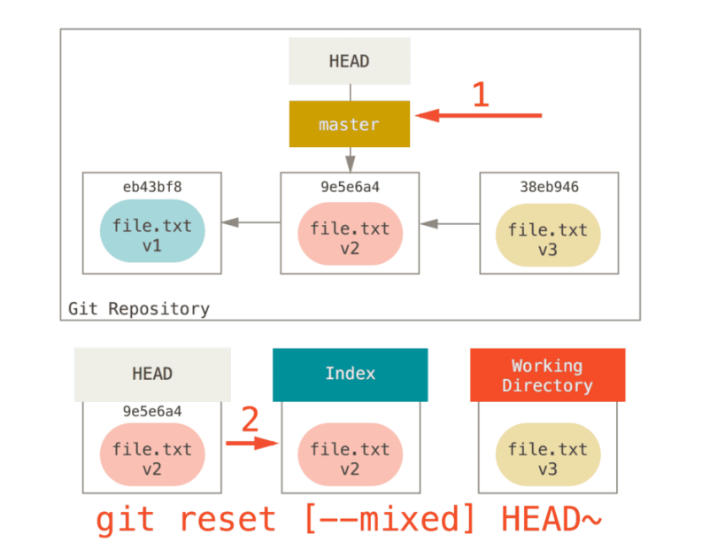
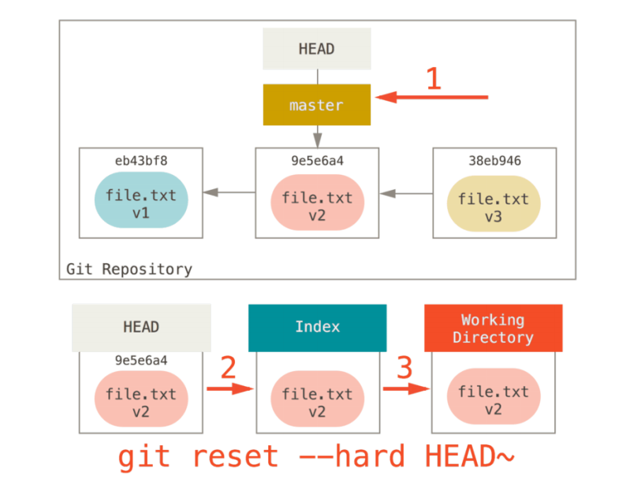
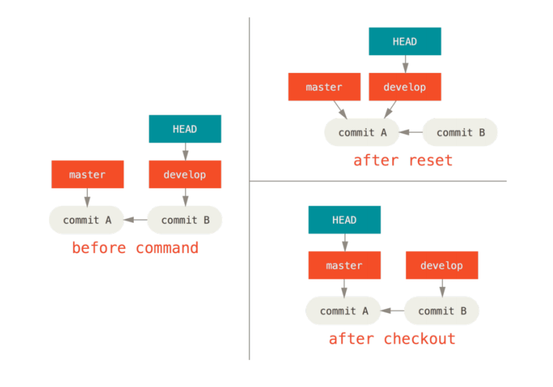

## git reset 
##  关键词
+ [提交对象](https://git-scm.com/book/zh/v2/Git-%E5%86%85%E9%83%A8%E5%8E%9F%E7%90%86-Git-%E5%AF%B9%E8%B1%A1) 
+ 三棵树
+ git status (git的状态,即三棵树的状态)其实是显示三棵树之间的差异
+ 工作目录就是将他们(HEAD,Index)解包为实际的文件以便编辑
### 三棵树 是什么?
这里的树是**文件的集合**，而不是特定的数据结构
+ git作为一个系统，是以他的一般操作来管理并操作这三棵树的

|树|用途|
|---|---|
|HEAD|上一次提交的快照，下一次提交的父节点|
|Index|预期的下一次提交的快照|
|Working directory|沙盒，工作空间|

+ HEAD：是当前**分支**的引用的指针，他总是指向分支的最后一次提交。这表示HEAD是下一次提交的父节点。通常，理解HEAD的方式就是将他理解为你的上一次提交的快照
  - git cat-file -p HEAD
  - git ls-tree -r HEAD
+ Index:索引是**预期的下一次提交**，我们也会将这个概念引用为git的**暂存区域**，这就是你运行git commit时git看起来的样子(注意:"git看起来的样子")
  - git ls-files -s
  - Git 将上一次检出到工作目录中的所有文件填充到索引区，它们看起来就像最初被检出时的样子。 之后你会将其中一些文件替换为新版本，接着通过 git commit 将它们转换为树来用作新的提交。
+ Working directory：另外两棵树以一种高效但是并不直观的方式将他们的内容存储在.git文件夹下面。**工作目录就是将他们解包为实际的文件以便编辑**。你可以将工作目录当作沙盒，在你修改提交到暂存区并记录到历史(记录到历史：commit)之前，可以随意修改(日常开发)
    <div></div>
### 工作流程
git的主要目的就是通过操作这三棵树来以更加连续的状态记录项目的快照
    <div></div>
+ 让我们来可视化这整个过程
1. 假设我们进入到一个新目录，其中只有一个新文件。我们成为该文件的v1版本，将他标记为蓝色。现在运行git init,这会创建一个git仓库，其中的HEAD就执行未创建的分支(master还不存在),此时三棵树的状态 
  - <div></div>
  - 此时，只有工作目录才有文件
2. 现在，我们需要提交该文件。使用git add ， 获取到该文件的内容，将其添加到索引区。现在三棵树的状态
  - <div></div>
3. 接着，运行git commit,他会取得索引区的内容，并将他们保存为一个永久的快照，然后创建一个指向该快照的提交对象，最后更新master来指向本次提交
  - 即:commit -> 创建commit对象 -> 更新HEAD(master)指针
  - 此时，三棵树的状态
  - <div></div>
  - 此时，如果我们运行git status,会发现没有任何改变，因为这三棵树的内容是一致的。
4. 现在，我们想要修改文件并且提交他。需要经历相同的阶段：首先需要在工作目录修改文件，我们称为该文件的v2版本，并且标为红色。
  - 此时，三棵树的状态
     <div></div>
  - 如果现在运行 git status，我们会看到文件显示在 “Changes not staged for commit,” 下面并被标记为红色，因为该条目在索引与工作目录之间存在不同。 接着我们运行 git add 来将它暂存到索引中。
5. 运行git add , 来将该文件再次添加到索引区
   - 此时，三棵树的状态
      <div></div>
   - 此时，由于HEAD与索引区不同，若运行 git status 的话就会看到 “Changes to be committed” 下的该文件变为绿色 ——也就是说，现在预期的下一次提交与上一次提交不同。 最后，我们运行 git commit 来完成提交
6. 运行 git commit，来进行提交
   - 此时，三棵树的状态
     <div></div>
   - 若此时运行git status,会没有输出，因为三棵树的状态一致了
### 切换分支
切换分支或克隆的过程也类似。 当检出一个分支时，它会修改 HEAD 指向新的分支引用，将 索引 填充为该次提交的快照，然后将 索引 的内容复制到 工作目录 中。
  + 注意，是将**索引**填充为新分支的第一次提交，且使用**索引区**的内容填充到工作目录中
  + 存在这么一种情况:
    - 在master分支修改一个文件，并且添加在暂存区(Index区，其实不论是否添加到Index区，在Working Direrectory也一样)，然后创建一个分支del，那么在分支del中的Index区也会存在该文件，若在del分支将该文件git commit掉，那么再回到master分支，master分支的Index区就没有该文件了，且master分支的该文件内容是上一次提交的内容。
    - 针对于上面所述的情况，上面的情况只会发生在新建分支的时候，切换也只是切换到新建的分支上面。若，妄想切换到已存在的分支上面，就会报错：
    ```
        error: Your local changes to the following files would be overwritten by checkout:
        Hello.c
        Please, commit your changes or stash them before you can switch branches.
        Aborting
    ```
  + 正常情况下的分支切换(已存在分支间的切换)
    -  请牢记：当你切换分支的时候，Git 会重置你的工作目录，使其看起来像回到了你在那个分支上最后一次提交的样子。 Git 会自动添加、删除、修改文件以确保此时你的工作目录和这个分支最后一次提交时的样子一模一样。
       - 这里只提到了工作目录，但是Index区呢?待会儿补充,git checkout [branch] 它会更新所有三棵树使其看起来像 [branch]
### 重置
1. 为了演示这些例子，假设我们再次修改了 file.txt 文件并第三次提交它。 现在的历史看起来是这样的
    <div></div>

    - 让我们跟着 reset 看看它都做了什么。 它以一种简单可预见的方式直接操纵这三棵树。 它做了**三个基本操作**
#### 三个基本操作
1. 第一步：移动HEAD (--soft)
reset 做的第一件事是移动 HEAD 的指向。 这与改变 HEAD 自身不同（checkout 所做的）；reset 移动HEAD 指向的分支。 这意味着如果 HEAD 设置为 master 分支（例如，你正在 master 分支上），运行 git reset 9e5e64a 将会使 master 指向 9e5e64a。
   + 图示
      <div></div>
   + 说明:
     - 无论你调用了何种形式的带有一个提交的 reset，它首先都会尝试这样做。 使用 reset --soft，它将仅仅**停**在那儿(停在这里是什么意思，见其他参数就知道了)，（git reset --soft后，该文件是未提交状态，已暂存）
     - 它本质上是撤销了上一次 git commit 命令。 当你在运行 git commit 时，Git 会创建一个新的提交，并移动 HEAD 所指向的分支来使其指向该提交。 当你将它 reset 回HEAD~（HEAD 的父结点）时，其实就是把该分支移动回原来的位置，而不会改变索引和工作目录(这就是“停”的意思，即不会修改索引和工作目录)。 现在你可以更新索引并再次运行 git commit 来完成 git commit --amend 所要做的事情了（见 修改最后一次提交）。

2. 第二步：更新索引 (--mixed)
+ 注意，如果你现在运行 git status 的话，就会看到新的 HEAD 和以绿色标出的它和索引之间的区别。(基于上述的三次提交和git reset --soft HEAD~)
+ reset 会用 HEAD 指向的当前快照的内容来更新索引(使用参数--mixed).图示如下
    <div></div>
+ 如果指定 --mixed 选项，reset 将会在这时停止(即更新索引区，但是不更新工作目录)。 这也是默认行为，所以如果没有指定任何选项（在本例中只是 git reset HEAD~），这就是命令将会停止的地方。(git reset --mixed后，该文件是未暂存状态)
+ **现在再看一眼上图，理解一下发生的事情：它依然会撤销一上次 提交，但还会 取消暂存 所有的东西。 于是，我们回滚到了所有 git add 和 git commit 的命令执行之前**

3. 第三步:更新工作目录 (--hard)
+ reset 要做的的第三件事情就是让工作目录看起来像索引。 如果使用 --hard 选项，它将会继续这一步。图示如下:
   <div></div>
+ 必须注意，--hard 标记是 reset 命令唯一的危险用法，它也是 Git 会真正地销毁数据的仅有的几个操作之一。其他任何形式的 reset 调用可以轻松撤消，但是 --hard 选项不能，因为它强制覆盖了工作目录中的文件。在这种特殊情况下，我们的 Git 数据库中的一个提交内还留有该文件的 v3 版本，我们可以通过 reflog 来找回它。但是若该文件还未提交，Git 仍会覆盖它从而导致无法恢复。

### 根据路径来重置
若指定了一个路径，reset 将会跳过第 1 步，并且将它的作用范围限定为指定的文件或文件集合。 这样做自然有它的道理，因为 HEAD 只是一个指针，你无法让它同时指向两个提交中各自的一部分。 不过索引和工作目录 可以部分更新，所以重置会继续进行第 2、3 步
+ 例如：运行 git reset file.txt （这其实是 git reset --mixed HEAD file.txt 的简写形式，因为你既没有指定一个提交的 SHA-1 或分支，也没有指定 --soft 或 --hard），它会：
  1. 移动 HEAD 分支的指向 （已跳过）
  2. 让索引看起来像 HEAD （到此处停止）
  3. 本质：所以它本质上只是将 file.txt 从 HEAD 复制到索引中。
+ git reset file.txt  图示如下
     <div></div>
     - 与git add图示相比较，你会发现该命令有取消暂存的效果。但是事实是：这个命令确实有
#### 使用git reset来获取任意一个提交中的指定文件
我们可以不让 Git 从 HEAD 拉取数据，而是通过具体指定一个提交来拉取该文件的对应版本。 我们只需运行类似
于 git reset **eb43bf** file.txt 的命令即可

### reset 与 checkout的区别
和 reset 一样，checkout 也操纵三棵树，不过它有一点不同，这取决于你是否传给该命令一个文件路径。
####  不带路径
运行 git checkout [branch] 与运行 git reset --hard [branch] 非常相似，它会更新所有三棵树使其看起来像 [branch]，不过有两点重要的区别。
1. 首先不同于 reset --hard，checkout 对工作目录是安全的，**它会通过检查来确保不会将已更改的文件弄丢**。 其实它还更聪明一些。它会在工作目录中先试着简单合并一下，这样所有_还未修改过的_文件都会被更新。 而 reset --hard 则会不做检查就全面地替换所有东西。
2. 第二个重要的区别是如何更新 HEAD。 reset 会移动 HEAD 分支的指向，而 checkout 只会移动 HEAD 自身来
指向另一个分支
   - 例如，假设我们有 master 和 develop 分支，它们分别指向不同的提交；我们现在在 develop 上（所以HEAD 指向它）。 如果我们运行 git reset master，那么 develop 自身现在会和 master 指向同一个提交。 而如果我们运行 git checkout master 的话，develop 不会移动，HEAD 自身会移动。 现在 HEAD 将会指向 master。
   - 所以，虽然在这两种情况下我们都移动 HEAD 使其指向了提交 A，但_做法_是非常不同的。 reset 会移动HEAD 分支的指向，而 checkout 则移动 HEAD 自身
   - 图示:
      <div></div>
#### 带路径
运行 checkout 的另一种方式就是指定一个文件路径，这会像 reset 一样不会移动 HEAD。 它就像 git
reset [branch] file 那样用该次提交中的那个文件来**更新索引**，但是它也会覆盖工作目录中对应的文件。
它就像是 git reset --hard [branch] file[**等价于 git checkout HEAD file**]（如果 reset 允许你这样运行的话）- 这样对工作目录并不安全，它也不会移动 HEAD。此外，同 git reset 和 git add 一样，checkout 也接受一个 --patch 选项，允许你根据选择一块一块地恢复文件内容
  + 不同点
     1. git checkout HEAD file 与 git reset file(其实 --mixed)相比，git checkout不仅会使用该此提交的文件来更新Index区，还会更新工作目录中相对应的文件。
     2. git checkout HEAD file 不仅会更新Index区，还会更新工作目录，这样对于项目来说是不安全的
  + 相同点:
     1. 均会更新Index区
##### git checkout带路径时携带提交对象id和不携带提交对象id的区别
+ 携带提交对象id,即: git checkout  **HEAD** xxxx文件
  - 这种方式会**使用HEAD区的文件覆盖掉Index区和工作空间的文件**,因此,这个操作很危险
  - 此种情况时的命令输出: Updated 1 path from **d509831**
+ 不携带提交对象id,即: git checkout xxxx文件
  - 这种方式会**使用Index区的文件覆盖掉工作空间的文件**,这个操作也具有一定危险性.
  -  此种情况时的命令输出: Updated 1 path from the **index**