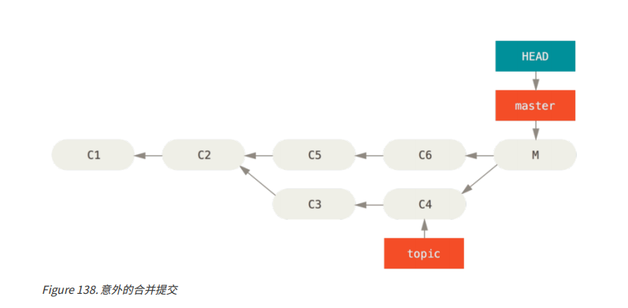
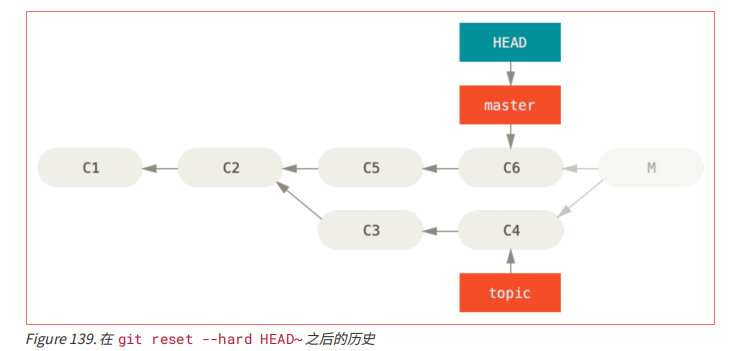
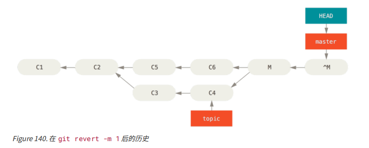
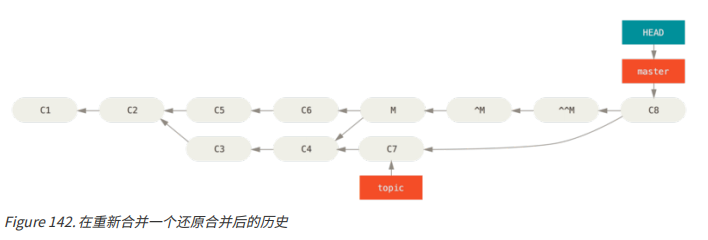

## git revert
+ 功能: 撤销一个提交的所有修改
   - 通过创建一条新的commit，覆盖之前的某一次commit所提交的内容，但是不会影响之前的提交信息。
### 撤销合并
合并提交并无不同。 假设现在在一个特性分支上工作，**不小心**将其合并到 master 中，现在提交历史看起来是这样：
  <div></div>

#### 有两种方法来解决这个问题，取决于你需要的结果是什么
##### 方式一： 修复引用(使用 git revert命令)
+ 只会移动分支的指向
  - 会修改提交历史
  - 要求该合并只存在你本地仓库中
+ 命令: git reset 
+ 局限性：这个你不想要的提交**仅仅**存在于你的本地仓库中，那么最好的解决方案就是移动分支的指针，使他移动到你需要他指向的位置。那么此时就可以执行 git reset --hard HEAD~,那么就会移动分支的指针如下图一样:
  <div></div>

+ 缺点：(该错误的合并被共享了，就不能这样处理了)
   - 这个方法的缺点是它会重写历史，在一个共享的仓库中这会造成问题的。 用简单的话说就是如果其他人已经有你将要重写的提交，你应当避免使用 reset。 如果有任何其他提交在合并之后创建了，那么这个方法也会无效；移动引用实际上会丢失那些改动。
##### 方式二：还原提交(使用git revert命令)
+ Git 给你一个生成一个新提交的选项，提交将会撤消一个已存在提交的所有修改。
   - 不会重写历史
   - 会撤销一个提交的所有修改
+ 命令&&使用方式
   - 命令:git revert 
   - 使用方式:git revert -m 1 HEAD
     + -m 1 标记指出 “mainline” 需要被保留下来的父结点。 当你引入一个合并到 HEAD（git merge topic），新提交有两个父结点：第一个是 HEAD（C6），第二个是将要合并入分支的最新提交（C4）。 在本例中，我们想要撤消所有由父结点 #2（C4）合并引入的修改，同时保留从父结点 #1（C6）开始的所有内容
     + 这里的1代表父节点1,需要保留的内容
+ 运行完git revert -m 1 HEAD之后，提交历史是这样的
  <div></div>
   这里的^M与C6有一模一样的内容，所以从这里看就像合并从未发生过。但是，如果你需要再将topic合并到master上，那么你就会感到郁闷了:

    ```
    $ git merge topic
    Already up-to-dat
    ```
     + 这是为什么呢?
       - topic 中并没有东西不能从 master 中追踪到达.更糟糕的是： 如果你在 topic 中增加工作然后再次合并，Git只会引入被还原的合并 之后 的修改(撤销之前的就不能合并了，即C3,C4的不会合并过来)。
         <div></div>
     + **解决方案**: 这个最好的方式是撤消还原原始的合并，因为现在你想要引入被还原出去的修改，然后 创建一个新的合并提交.如下图：
        ```
        $ git revert ^M
        [master 09f0126] Revert "Revert "Merge branch 'topic'""
        $ git merge topic
        ```
        <div></div>

        - 在本例中，M 与 ^M 抵消了。 ^^M 事实上合并入了 C3 与 C4 的修改，C8 合并了 C7 的修改，所以现在 topic 已经完全被合并了。